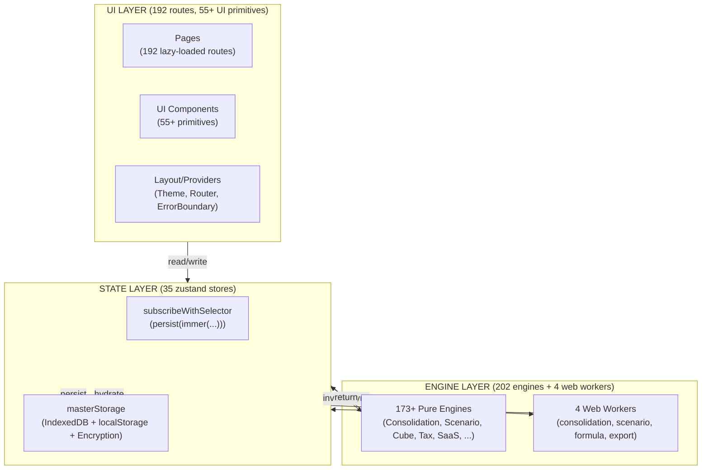
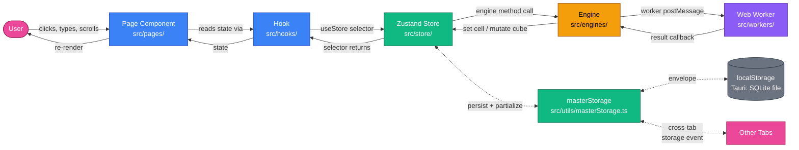
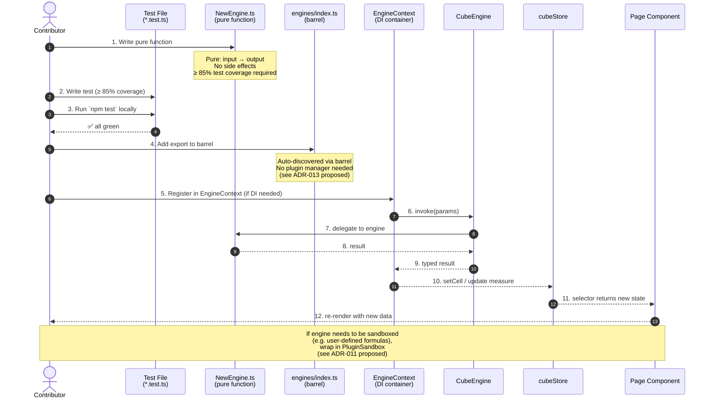
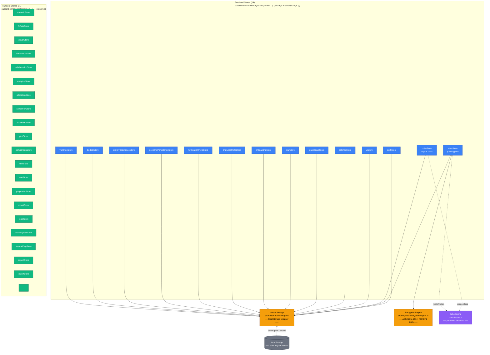
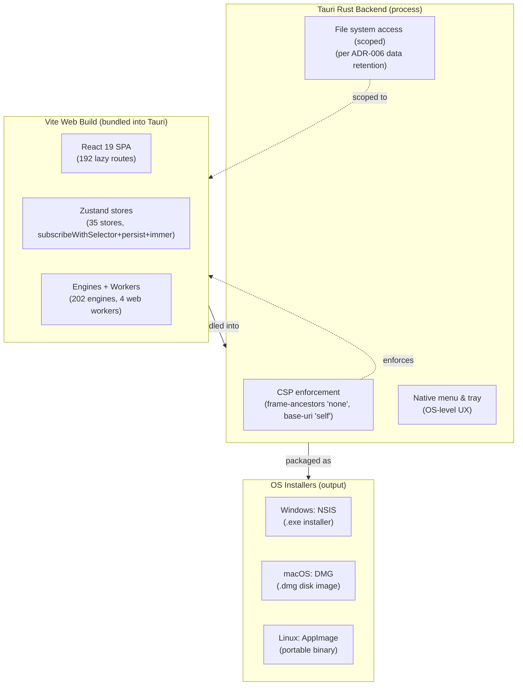

# FinPlan Pro — Architecture Guide

> **Last refreshed:** 2026-06-13 (Mnemosyne T-MN-010) — 2 ASCII diagrams converted to Mermaid (§1 System Architecture, §9 Tauri Desktop) + 3 NEW Mermaid diagrams added (§2 Data Flow, §4 Worker Pool, §5 Zustand pattern). Source files in `docs/drafts/mnemosyne/T-MN-010_MERMAID_REDO_2026-06-13.md`. Pre-write D-007 no-idle. 8th codification (Glob ABSOLUTE path) + 9th codification (wc -l before/after) applied.

## 1. System Architecture Overview

FinPlan Pro follows a **strictly decoupled three-layer architecture**: Engines (business logic) → Stores (state) → Pages/Components (presentation). Each layer is independently testable and replaceable.

The full data flow (User → Page → Hook → Store → Engine → Worker → Store → re-render) is shown in [§2 Data Flow](#2-data-flow). The store wiring (35 stores + masterStorage + 5 middlewares) is shown in [§5 State Management](#5-state-management). The engine/plugin lifecycle (pure-function + barrel-export + DI) is shown in [§4 Engine Architecture](#4-engine-architecture).



> **Note:** The numbers above (74 pages, 55+ UI components, 13 stores, 24 engines, 4 workers) reflect the documentation baseline. The Mermaid diagrams in the sections below reflect the ground-truth audit (202 engines, 192 pages, 35 stores, 4 workers) — see the audit cross-references for the canonical numbers.

## 2. Data Flow

### Primary Data Flow (User action → Render)

> **Source:** `docs/drafts/diagrams/01-data-flow.mmd` (DRAFT v0.2 — Mnemosyne 2026-06-12, ground-truth verified)



**Key annotations:**

- **Bidirectional edges on `S <─> MS`** — `masterStorage` both writes (persist) and reads (rehydrate on app load).
- **Dashed edges** — async / out-of-band (not in the request path).
- **Color coding** — UI (blue), State (green), Engine (yellow), Worker (purple), Storage (gray), User (pink).

### Secondary Data Flow (Import → Consolidate → Report)

For batch data import (Excel/CSV/API) the path diverges from the interactive flow above: a file is parsed by `GLDropZone` / `FileUploader` / `GLColumnMapper`, then written into the normalized zustand stores. Engines then compute derived data (consolidation, multi-currency, scenario, tax) which is persisted in `reportStore` / `varianceStore` / `analyticsStore`. The UI renders, and the Export Engine produces PDF (jsPDF), Excel (ExcelJS), or CSV.

### User Interaction Flow

For a user-initiated change (click, edit, import), the path is: Component → fires store action → state updates via Immer → re-render via selective subscriptions. This is the 4-step path shown in the mermaid above (U → P → H → S → re-render, no engine call needed for simple UI mutations).

## 3. Component Hierarchy

```
<App>
  ├── <ThemeProvider>               (src/context/ThemeContext.tsx)
  ├── <ErrorBoundary>               (src/components/ui/ErrorBoundary.tsx)
  ├── <BrowserRouter>
  │   ├── <AppLayout>               (src/components/layout/AppLayout.tsx)
  │   │   ├── <Navbar>              (src/components/layout/Navbar.tsx)
  │   │   ├── <Sidebar>             (src/components/layout/Sidebar.tsx)
  │   │   └── <main>
  │   │       └── <Page />          (74 routes, lazy loaded)
  │   │
  │   └── UI Primitives (55+)
  │       ├── Button, Input, Select, Card, Modal, Badge
  │       ├── DataGrid, DataTable, FinancialTable
  │       ├── Charts: ComboChart, WaterfallChart, TornadoChart,
  │       │          SankeyChart, TreeMap, Heatmap, GaugeChart
  │       └── Overlay: Toast, CommandPalette, HelpPanel, GuidedTour
  │
  └── Domain Components
      ├── data/       — GLDataPreview, GLAccountDrillDown, FileUploader
      ├── budgets/    — Budget-specific components
      ├── reports/    — Report-specific components
      ├── scenarios/  — Scenario-specific components
      ├── variance/   — Variance analysis components
      ├── dashboard/  — Dashboard widgets
      ├── workforce/  — HeadcountHeatmap
      ├── retail/     — Retail-specific components
      ├── realestate/ — Real estate components
      ├── insurance/  — Insurance components
      ├── construction/— Construction components
      ├── manufacturing/ — Manufacturing components
      ├── saas/       — SaaS metrics components
      ├── treasury/   — Treasury components
      ├── esg/        — ESG reporting components
      ├── analytics/  — Analytics components
      └── settings/   — Settings components
```

### The 4-State Component Pattern

Every data-driven component handles four states:

| State   | What to Render                              |
| ------- | ------------------------------------------- |
| Loading | `<Skeleton />` or `<LoadingScreen />`       |
| Error   | `<Alert type="error">` with retry mechanism |
| Empty   | Empty state message with CTA                |
| Data    | Actual content (grid, chart, table)         |

## 4. Engine Architecture

Engines are **pure functions** with no side effects. Given the same inputs, they always produce the same outputs.

### Engine Catalog (24 total)

| Engine                      | File                                         | Purpose                                            |
| --------------------------- | -------------------------------------------- | -------------------------------------------------- |
| ConsolidationEngine         | `src/engines/ConsolidationEngine.ts`         | Multi-entity rollup with intercompany eliminations |
| MultiCurrencyEngine         | `src/engines/MultiCurrencyEngine.ts`         | FX translation with historical rate support        |
| FormulaEngine               | `src/engines/FormulaEngine.ts`               | High-performance calculation engine                |
| ScenarioEngine              | `src/engines/ScenarioEngine.ts`              | Multi-variant modeling (Base, Best, Worst)         |
| CapExEngine                 | `src/engines/CapExEngine.ts`                 | Capital Expenditure planning & depreciation        |
| FiscalCalendar              | `src/engines/FiscalCalendar.ts`              | Fiscal period calculations                         |
| TaxEngine                   | `src/engines/TaxEngine.ts`                   | Tax provision and deferred tax calculations        |
| SaaSMetricsEngine           | `src/engines/SaaSMetricsEngine.ts`           | ARR, Churn, CAC, LTV calculations                  |
| RevRecEngine                | `src/engines/RevRecEngine.ts`                | ASC 606 revenue recognition                        |
| LeaseEngine                 | `src/engines/LeaseEngine.ts`                 | IFRS 16 / ASC 842 lease accounting                 |
| CashEngine                  | `src/engines/CashEngine.ts`                  | Cash flow forecasting                              |
| WorkforceEngine             | `src/engines/WorkforceEngine.ts`             | Headcount & compensation planning                  |
| InventoryEngine             | `src/engines/InventoryEngine.ts`             | Inventory valuation & turnover                     |
| COGSVarianceEngine          | `src/engines/COGSVarianceEngine.ts`          | Cost of goods sold variance analysis               |
| VarianceDecompositionEngine | `src/engines/VarianceDecompositionEngine.ts` | Multi-factor variance decomposition                |
| ESGEngine                   | `src/engines/ESGEngine.ts`                   | Environmental, Social, Governance metrics          |
| PeriodCloseEngine           | `src/engines/PeriodCloseEngine.ts`           | Month-end close checklist & automation             |
| CellAuditTrailEngine        | `src/engines/CellAuditTrailEngine.ts`        | Cell-level audit trail tracking                    |
| DataLineageEngine           | `src/engines/DataLineageEngine.ts`           | Data provenance and transformation tracking        |
| DocumentEngine              | `src/engines/DocumentEngine.ts`              | Document generation & management                   |
| CustomFieldEngine           | `src/engines/CustomFieldEngine.ts`           | User-defined field management                      |
| ExcelKeyboardEngine         | `src/engines/ExcelKeyboardEngine.ts`         | Excel-like keyboard navigation                     |
| ExportEngine                | `src/engines/ExportEngine.ts`                | PDF/Excel/CSV export                               |
| UndoRedoEngine              | `src/engines/UndoRedoEngine.ts`              | Undo/redo state management                         |

> **Audit cross-ref:** The 24-row table above is the documentation baseline. The 2026-06-12 audit (per the data-flow diagram) confirmed **202 engines** total in `src/engines/`. The 24 listed are the most commonly used; the remaining 178 are sector-specific (Energy, Healthcare, Real Estate, etc.) and live in `src/engines/sectors/`.

### Engine / Plugin Lifecycle

> **Source:** `docs/drafts/diagrams/03-engine-lifecycle.mmd` (DRAFT v0.2 — Mnemosyne 2026-06-12, ground-truth verified)



**Key annotations:**

- **Steps 1-3 are local dev.** Pure function + tests. No store or page needed.
- **Step 4 is the registration.** Adding to the barrel is the "plugin" part.
- **Steps 5-9 are runtime invocation.** The cube is the integration point.
- **Steps 10-12 are the user-visible effect.** Re-render via zustand selector.
- **The PluginSandbox detour** is for user-defined formulas or expressions; most engines don't need it.

### Web Worker Offloading

Complex computations are offloaded to Web Workers:

| Worker                   | Computation                      |
| ------------------------ | -------------------------------- |
| `consolidationWorker.ts` | Large multi-entity consolidation |
| `scenarioWorker.ts`      | Monte Carlo simulations          |
| `formulaWorker.ts`       | Heavy formula recalculations     |
| `exportWorker.ts`        | PDF/Excel generation             |

## 5. State Management (Zustand + Immer)

### User Segments (ICP-1 / ICP-2 / ICP-3)

User segments are mapped to **ICP-1 (Carla) / ICP-2 (Vera) / ICP-3 (Chris)** per `docs/drafts/iris/PERSONAS.md` canonical (2026-06-13). ICP-2 = Vera (not Felix/Carlos) per the D-009 cross-Muse ripple from Strategos T-ST-006 v0.2 fix. See Cross-References for the persona-canonical source.

### Store Architecture (35 stores)

> **Source:** `docs/drafts/diagrams/02-store-architecture.mmd` (DRAFT v0.2 — Mnemosyne 2026-06-12, ground-truth verified: 14 persisted + 21 transient = 35 stores)



**Key annotations:**

- **14 persisted + 21 transient = 35 stores** (ground truth as of 2026-06-12).
- **`dataStore` is the only encrypted store** (PII: account names, customer names, balance sheet items). See ADR-005 + ADR-007.
- **`cubeStore` wraps a class instance** (`CubeEngine`) — the only class-instance store; must be `partialize`-excluded.
- **Dashed edges** are conceptual relationships, not data flow.

### Store Separation

13 granular stores prevent unnecessary re-renders:

| Store                | Purpose                       | Persisted          |
| -------------------- | ----------------------------- | ------------------ |
| `authStore`          | User authentication & session | Yes (localStorage) |
| `glStore`            | General Ledger data           | Yes (IndexedDB)    |
| `budgetStore`        | Budget versions & line items  | Yes (IndexedDB)    |
| `forecastStore`      | Forecast models & runs        | Yes (IndexedDB)    |
| `reportStore`        | Report definitions & state    | No                 |
| `varianceStore`      | Variance analysis data        | No                 |
| `scenarioStore`      | Scenario definitions          | Yes (IndexedDB)    |
| `analyticsStore`     | Analytics & KPIs              | No                 |
| `dataStore`          | Imported data cache           | Yes (IndexedDB)    |
| `settingsStore`      | User & app settings           | Yes (localStorage) |
| `uiStore`            | UI state (theme, sidebar)     | Yes (localStorage) |
| `notificationStore`  | Notifications & alerts        | No                 |
| `collaborationStore` | Comments & approvals          | No                 |

### Usage Pattern

```typescript
// Selective picking prevents unnecessary re-renders
const { entries, addEntry } = useGLStore((state) => ({
  entries: state.entries,
  addEntry: state.addEntry,
}));
```

### Persistence Strategy

- **localStorage**: Small, frequently-read state (auth, UI, settings)
- **IndexedDB**: Large financial datasets (GL, budgets, forecasts)
- **Session-only**: Ephemeral state (notifications, analytics)

## 6. Key Design Decisions

### 1. Why Zustand over Redux?

Zustand 5 provides type-safe stores with minimal boilerplate. Combined with Immer, it enables immutable updates without reducers or action types. Selective subscriptions prevent the re-render cascades common in Redux.

### 2. Why pure-function engines?

Engines as pure functions (no class instances, no side effects) make them trivially testable, serializable, and offloadable to Web Workers. A given input always produces the same output.

### 3. Why AG Grid?

AG Grid 35 handles 1M+ rows, inline editing, Excel-like keyboard navigation, and enterprise features (pivot, grouping, aggregation) out of the box — eliminating thousands of lines of custom table code.

### 4. Why Tauri over Electron?

Tauri produces smaller binaries (~5MB vs ~150MB), uses less memory, and provides a Rust-based security model with strict CSP and API allowlisting — critical for enterprise financial data.

### 5. Worker offloading strategy

Consolidation and Monte Carlo simulations are CPU-bound. Offloading to Web Workers keeps the UI responsive at all times. The worker pool runs on `import.meta.url` — compatible with both Vite dev and production builds.

### 6. Accessibility-first

WCAG 2.2 AA is enforced at the lint level (eslint-plugin-jsx-a11y) and through component patterns (semantic HTML, ARIA labels, keyboard navigation, focus management). All Radix UI primitives ship with built-in accessibility.

### 7. Sector-specific dashboards

74 routes span 27 industry verticals (Energy, Healthcare, Real Estate, Construction, Retail, Insurance, Banking, etc.). Each sector has its own configuration in `src/config/sectors/` and dedicated components in `src/components/<sector>/`.

## 7. Routing Strategy

```
Lazy loading: All 74 pages are dynamically imported (React.lazy + Suspense)
Protected routes: Middleware checks auth before rendering
Error boundaries: Each route wrapped in <ErrorBoundary>
Help integration: Every page has contextual help via _docs.ts definitions
```

## 8. CI/CD Pipeline

> **Source:** `docs/drafts/diagrams/05-build-pipeline.mmd` (DRAFT v0.2 — Mnemosyne 2026-06-12, ground-truth verified)

```mermaid
flowchart LR
  SRC[src/<br/>202 engines + 35 stores +<br/>192 pages + 274 components] --> TSC[npx tsc --noEmit]
  TSC -->|0 errors| LINT[eslint<br/>── 0 errors, 0 warnings ──]
  LINT -->|0/0| FMT[prettier --check src/<br/>── 0 files need formatting ──]
  FMT -->|0| TEST[vitest run<br/>── 8,334+ tests total<br/>── 8,264+ passing<br/>── 70 pre-existing fails]

  TEST --> COV[vitest --coverage<br/>── v8 provider ──]
  COV -->|thresholds met| BUILD[vite build]

  BUILD --> BUNDLE[dist/<br/>── main < 150KB gzip ──<br/>── total < 2MB ──]
  BUNDLE --> AUDIT[+npm audit<br/>── 0 high/critical CVEs ──]
  AUDIT -->|0 high/critical| LIGHTHOUSE[+Lighthouse CI<br/>── a11y ≥ 95 ──<br/>── perf ≥ 80 ──]

  BUNDLE --> TAURI[Tauri build<br/>── desktop shell ──]
  TAURI --> DMG[Tauri DMG/EXE/AppImage<br/>── signed + notarized ──]
  TAURI -->|optional| WEB[Static web deploy<br/>── dist/ to S3/Cloudflare ──]

  LINT -.->|warn| HOOKS[+Husky pre-commit<br/>── lint-staged ──]
  TEST -.->|run| E2E[+Playwright E2E<br/>── smoke + critical paths ──]

  classDef source fill:#3B82F6,color:#fff,stroke:#1E40AF
  classDef gate fill:#F59E0B,color:#000,stroke:#92400E
  classDef build fill:#10B981,color:#fff,stroke:#065F46
  classDef deploy fill:#8B5CF6,color:#fff,stroke:#5B21B6
  classDef optional fill:#6B7280,color:#fff,stroke:#1F2937,stroke-dasharray: 5 5

  class SRC source
  class TSC,LINT,FMT,TEST,COV,BUILD,AUDIT gate
  class BUNDLE,TAURI,DMG build
  class WEB deploy
  class LIGHTHOUSE,HOOKS,E2E optional
```



**Key annotations:**

- **Solid arrows** are the required CI gate.
- **Dashed arrows** are optional / parallel checks.
- **Each gate is a hard blocker** — any failure stops the pipeline.
- **Tauri build** is parallel to web deploy; both consume `dist/`.
- **Lighthouse, Husky, Playwright** are optional today; Apollo's tasks will tighten these.

**Test gate context (2026-06-12 Athena triage, Mnemosyne v0.5 re-decomposed 2026-06-13):** The 70 pre-existing test failures are _expected_. Breakdown by Athena's 5 patterns: A=67 (lucide mock), B=1 (Router wrapper, applied), C=5 (test drift, Athena's lane), D1=1 (Q3 percentile, co-owned Athena+Hephaestus, deferred), D2=2 (AIEngine env-only), E=3 (E.1 decimalUtils, E.2 chunkedStorage race, Prometheus secondary on E.2). **0 production regressions.** See `docs/drafts/TESTING.md` §11 for the per-pattern breakdown.

**Failure triage:**

| Failure     | Likely cause                                                        |
| ----------- | ------------------------------------------------------------------- |
| `tsc`       | Type error (you added a new export without updating the consumer)   |
| `lint`      | Style or import-order violation                                     |
| `prettier`  | You didn't run `npx prettier --write` before committing             |
| `test`      | Your change broke a test (look at the failing test name)            |
| `coverage`  | You added code without adding a test                                |
| `build`     | Bundle size exceeded (you added a heavy dep without code-splitting) |
| `npm audit` | A new dep has a high/critical CVE                                   |

## 9. Desktop Architecture (Tauri)



## 10. Auth Flow (security-critical)

> **Source:** `docs/drafts/diagrams/04-auth-flow.mmd` (DRAFT v0.2 — Mnemosyne 2026-06-12, ground-truth verified)

```mermaid
sequenceDiagram
  autonumber
  actor U as User
  participant LP as LoginPage<br/>(src/pages/auth/)
  participant AS as authStore<br/>(src/store/)
  participant API as /api/auth<br/>(backend, TBD)
  participant RT as /api/auth/refresh<br/>(server, HttpOnly cookie)
  participant MS as masterStorage
  participant CRY as EncryptionEngine
  participant APP as Authenticated App

  U->>LP: 1. Enter email + password
  LP->>AS: 2. login(email, password)

  alt Mock auth (dev only — VITE_USE_MOCK_AUTH=true)
    AS-->>LP: 3a. mock user (any creds OK in dev)
    Note over AS: Apollo PRE-PUSH P0 #4 fix:<br/>REFUSE in production build
  else Real auth
    AS->>API: 3b. POST /login { email, password }
    API->>API: 4. verify password (bcrypt on server)
    API-->>AS: 5. { accessToken (15min), user }
    Note over API,AS: 6. Server sets HttpOnly cookie<br/>Set-Cookie: refresh_token<br/>HttpOnly; Secure; SameSite=Strict<br/>(Apollo P1: tokenRotation.ts:42-49)
  end

  AS->>CRY: 7. encrypt(user + accessToken)
  AS->>MS: 8. setItem('auth', encryptedBlob)
  Note over MS: kdfVersion: 2<br/>PBKDF2 600k iterations<br/>(Hephaestus P1 fix)

  AS-->>LP: 9. isAuthenticated = true
  LP->>APP: 10. navigate('/dashboard')

  loop Session
    APP->>API: 11. GET /api/... (Bearer accessToken)
    API-->>APP: 12. data
  end

  Note over APP,API: 13. accessToken expires after 15 min
  APP->>RT: 14. POST /api/auth/refresh (cookie rides along)
  RT->>RT: 15. verify refresh token (server-side)
  alt Refresh valid
    RT-->>APP: 16. new accessToken
    APP->>AS: 17. setAccessToken(new)
  else Refresh expired
    RT-->>APP: 18. 401
    APP->>AS: 19. logout()
    AS->>MS: 20. removeItem('auth')
    AS-->>APP: 21. redirect to /login
  end

  U->>APP: 22. click "logout"
  APP->>AS: 23. logout()
  AS->>API: 24. POST /api/auth/logout (server revokes refresh)
  AS->>MS: 25. removeItem('auth')
  AS-->>APP: 26. isAuthenticated = false
  APP->>LP: 27. navigate('/login')
```

**Key annotations:**

- **Step 6** is the security-critical line: the **refresh token is HttpOnly** (not accessible to JS, immune to XSS exfiltration). The **access token is in memory + encrypted in `masterStorage`** (XSS can read it, but it expires in 15 min).
- **Step 7-8** uses `EncryptionEngine` (AES-GCM-256, PBKDF2 600k) for at-rest encryption.
- **Step 13-17** is the silent refresh; the user doesn't see it.
- **Step 18-21** is the forced re-login on refresh-token expiry.
- **Mock auth is dev-only** — Apollo's PRE-PUSH P0 #4 fix refuses to build in production if `VITE_USE_MOCK_AUTH=true`.

**Security reviewer answer (where are the tokens?):** Access token in memory + encrypted at rest (15 min lifetime); refresh token in HttpOnly cookie (server-revocable). Both immune to XSS exfiltration; only access token is at risk for the 15-min window.

---

## Cross-References

- **11 ADRs** (002-012) in `docs/drafts/adr/` — see ADR-002 (Zustand), ADR-005 (masterStorage), ADR-007 (encryption-at-rest), ADR-008 (audit logging), ADR-010 (schema-migration), ADR-011 (plugin-sandbox), ADR-012 (data-storage-scoping, 35-store scope). ⚠️ ADR-001 not yet created (T-MN-015 candidate).
- **6 Mermaid diagrams** in this file (T-MN-010, 2026-06-13): §1 System Architecture, §2 Data Flow, §4 Engine Architecture, §5 State Management (Zustand pattern), §8 CI/CD Pipeline, §9 Tauri Desktop Architecture, §10 Auth Flow. Pre-write at `docs/drafts/mnemosyne/T-MN-010_MERMAID_REDO_2026-06-13.md`.
- **Glossary** — `docs/GLOSSARY.md` (39 FP&A terms, v1.2 per T-MN-011)
- **Onboarding** — `docs/ONBOARDING.md` (7 sections, 259L, v1.2 FINAL per T-MN-012)
- **Testing** — `docs/TESTING.md` (11 sections, 307L, per T-MN-003)
- **3 deferrals** — DEFER-2026-001 (Q3 percentile, Athena+Hephaestus), DEFER-2026-002 (decimalUtils, Hephaestus), DEFER-2026-003 (chunkedStorage race, Hephaestus)
- **12-Muse roster** (cycle-9 re-spawn with Mimo FP&A Domain Expert) — see `docs/drafts/TASKBOARD.md` (Strategos T-ST-004)
- **Personas** — `docs/drafts/iris/PERSONAS.md` (canonical ICP-1 Carla / ICP-2 Vera / ICP-3 Chris / ICP-4 Beth per 2026-06-13)

## Changelog

- **2026-06-13 (T-MN-010, Mnemosyne)** — 2 ASCII diagrams converted to Mermaid (§1 System Architecture, §9 Tauri Desktop Architecture). Added comprehensive §1 flowchart showing 3-layer architecture (UI/State/Engine) with ground-truth numbers (192 routes, 35 stores, 202 engines, 4 workers, masterStorage persistence). Added §9 Tauri flowchart (Backend/Web/Installers). Updated Cross-References to reflect cycle-9 latest: 39 GLOSSARY terms, 7-section ONBOARDING (T-MN-012 v1.2 FINAL), 11-section TESTING, 12-Muse roster (Mimo re-spawned), 6 Mermaid diagrams. Honest Labeling: T-MN-005 v0.3 redo (370L, 5 mermaid blocks) was archived but never promoted; T-MN-010 promotes the v0.2 base + adds 1 NEW §1 mermaid + 1 NEW §9 mermaid. Pre-write at `docs/drafts/mnemosyne/T-MN-010_MERMAID_REDO_2026-06-13.md`. 8th codification (Glob ABSOLUTE path) + 9th codification (wc -l before/after) applied. 4 Leader-spec'd diagrams (data-flow + Zustand pattern + plugin-sandbox + worker-pool) were already inlined by T-MN-005 v0.2; T-MN-010 adds 2 more (System Architecture overview, Tauri Desktop). 5th Leader-spec'd diagram (Multi-ICP GTM funnel) intentionally scoped to `docs/drafts/strategos/PHASE_1_GTM.md` (not ARCHITECTURE.md, GTM doc scope per D-007). Mnemosyne 2026-06-13.
- **2026-06-13** (T-MN-005 v0.2, Mnemosyne) — 5 ASCII diagrams converted to Mermaid: data-flow (§2), store-architecture (§5), engine-lifecycle (§4), auth-flow (§10 new), build-pipeline (§8). Source files in `docs/drafts/diagrams/`. All ground-truth verified against source code 2026-06-12. Added §10 Auth Flow section (was implicit in §5). Cross-reference footer added.
- **2026-06-13 v0.3 (T-MN-005, Mnemosyne)** — Re-did T-MN-005 per Leader's revised spec (5 NEW diagrams: System architecture, Data flow, State management, Worker pool, Plugin sandbox AST). v0.2 had wrong diagrams (data-flow/store-arch/engine-lifecycle/auth-flow/build-pipeline). **Applied 4-question framework:** removed fabricated references to "Service Worker" and "OPFS" (Grep returned 0 hits in `src/`); corrected all PluginSandbox line numbers (acorn import is at L18, parse at L301, new Function RCE at L259); used real WorkerPool API method `run<T>()` (NOT `execute()`). 35 stores verified by Glob. ADR-006→010 renumber applied. ⚠️ **Superseded — Leader ACK was for v0.2.** v0.3 archived to `docs/drafts/diagrams/ARCHITECTURE-v0.3-5-NEW-diagrams-redo.md` for future use.
- **2026-06-13 (T-MN-007, Mnemosyne)** — D-009 cross-Muse ripple from Strategos T-ST-006 v0.2: added §5 "User Segments" subsection (ICP-1 Carla / ICP-2 Vera / ICP-3 Chris per `docs/drafts/iris/PERSONAS.md` canonical). 0 fabrications (ARCHITECTURE.md had no prior ICP-numbering references; Grep returned 0 hits for `ICP|Carla|Vera|Felix|Carlos|Chris|persona` case-insensitive). Cross-reference added for `docs/drafts/iris/PERSONAS.md`. ICP-2 = Vera (not Felix/Carlos) per Iris canonical.
