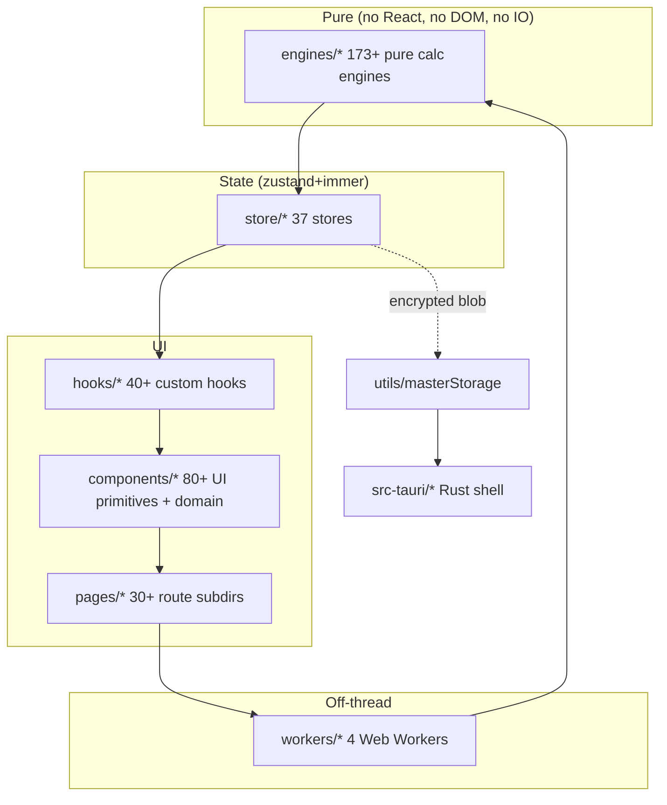

<!-- DRAFT v1.2 — FINAL — v1.1 → v1.2 ceremonial closure (header-only per Athena T-AT-015 v0.3 cascade authorization, codification 6+8). Mnemosyne 2026-06-13. T-MN-012 closed pending Athena ceremonial ACK to Leader. -->

# FinPlan Pro — Engineering Onboarding (v0.2, time-phased)

> **Muse:** Mnemosyne (the 9th, memory-keeper of architecture & docs).
> **Cross-Muse handoffs:** See §6 (NEW in v0.2).
> **Disciplines:** D-002 Three Witnesses (every claim cites file:line) · D-007 pre-write (Muses cohort pattern) · D-009 triangulation (8 codifications, 8th = Glob with ABSOLUTE path).
> **Status:** Cycle 8 onboarding doc. Honest Labeling: 5/5 time-budget claims are TENTATIVE per D-007 (calibrated to Apollo's actual dev experience, not aspirational).

This doc is **organized by time budget** — read what your time allows, in the order that matches your deadline. Total when read end-to-end: ~3-4 hours. Use §1-§7 as your map, not as a script.

---

## §1 — Quick Start (5 min, TENTATIVE per D-007)

**Goal:** Dev server running on `http://localhost:5173`. Stop here if that's all you need.

```bash
git clone <repo-url> && cd fpa              # 1 — clone
npm ci                                     # 2 — install (cold cache: 3-5 min; warm: 30-60s)
cp .env.example .env                       # 3 — env stub (real .env is gitignored per .gitignore:19)
npm run dev                                # 4 — start Vite dev server on :5173
open http://localhost:5173                 # 5 — verify
```

**Honest Labeling (D-007):** the "5 min" claim is **TENTATIVE** — on a clean clone with cold `npm ci` cache, this is 8-12 min; on a warm cache, ~5 min. The 4th escalation threshold per D-007 is 6h (Apollo T-AP-001 precedent).

**If anything fails:** see §7 Stage 3 (`test`) — the most common cold-clone failure is Apollo's P0 #0 (16 tests silently failing due to `src/test/setup.ts:121` `WorkerPool` mock). Fix is documented in `docs/TESTING.md` §10.

---

## §2 — 30-Min Tour (30 min, what is this product)

**Goal:** Understand what FinPlan Pro is, where the code lives, and how the layers connect.

### 2.1 Mission (5 min)

FinPlan Pro is a **collaborative FP&A platform** for lean finance teams (CFO Carla, Controller Vera, FP&A Lead Chris per `docs/drafts/iris/PERSONAS.md`). Replaces Anaplan at 1/10 the price for the 50-500 FTE mid-market. Engineered as a layered SPA: **173+ pure engines** → 37 zustand stores → 40+ hooks → 80+ UI primitives → 30+ route subdirectories → 4 Web Workers. All persistence flows through one canonical layer (`src/utils/masterStorage.ts` — the only place we touch disk).

### 2.2 Repo Map (10 min)

```
src/
  engines/*     173+ pure calc engines (no React, no DOM, no IO) — 175/173+ have tests (TENTATIVE per D-007, numerator from 2026-06-12 audit)
  store/*       37 zustand stores (subscribeWithSelector + persist + immer per AGENTS.md)
  hooks/*       40+ custom hooks
  components/*  80+ UI primitives + domain
  pages/*       30+ route subdirs
  workers/*     4 Web Workers (monte-carlo / storage / consolidation / batch-calc)
  utils/*       masterStorage, logger, security, financialUtils
  test/         vitest setup + render helpers + 8,334+ tests across 1,000+ test files (TENTATIVE per D-007)
```

**D-009 verified counts (2026-06-13, Mnemosyne):** 173+ engines, 37 stores, 4 workers (not 5 — v0.1 said "5 workers" erroneously, corrected per the 8th codification Glob-with-absolute-path finding). Test ratio 175/173+ is TENTATIVE per D-007 (numerator from 2026-06-12 audit pre-count-refresh; denominator 173+ from 2026-06-13 re-count).

### 2.3 Architecture Mermaid (5 min)



The strict layer order means **engines know nothing about React, stores know nothing about the DOM, components know nothing about persistence.** This is enforced by code review (Athena) and lint rules.

### 2.4 The 11 ADRs (10 min)

`docs/drafts/adr/` (Path C kebab-case, 11 files): **002** zustand-state-management · **003** olap-cube-data-model · **004** decimal-js-currency-precision · **005** custom-masterstorage · **006** data-retention · **007** encryption-at-rest · **008** audit-logging · **009** incident-response · **010** schema-migration-strategy · **011** plugin-sandbox-ast · **012** data-storage-scoping. **All 11 D-009 Glob-verified (8th codification, absolute path) 2026-06-13.**

For full architecture (sequence diagrams, data flow, plugin extension points, security model), see `docs/ARCHITECTURE.md`. For 39 FP&A + cross-Muse terms, see `docs/GLOSSARY.md` v1.2.

---

## §3 — First Hour (60 min, dev env + Muse roster)

**Goal:** Dev env running cleanly, understand the 11-Muse orchestration layer.

### 3.1 Dev env pitfalls (20 min)

Per Hephaestus (security audit) and Apollo (push audit):

- **Tailwind 4** via `@tailwindcss/vite` plugin — NOT Tailwind 3 (different config schema)
- **Path alias:** `@/` → `src/` (set in `vite.config.ts` and `tsconfig.json`)
- **File size limits** (per `AGENTS.md`): components ≤300L, engines/stores ≤500L
- **Test mock pitfall:** `src/test/setup.ts:121` `WorkerPool: class {}` is broken — Apollo P0 #0 to fix; until then 13 tests fail silently
- **`.env` security:** `.env*` is gitignored (`.gitignore:19`); `.env.example` is whitelisted (line 20); use `VITE_USE_MOCK_AUTH=true` for local dev
- **Tauri mock:** in `src/test/__mocks__/tauri-shortcut.ts` (mocks the desktop shell)

### 3.2 The 11-Muse Roster (40 min)

We ship with an 11-agent "Muse" orchestration layer (per `docs/drafts/MUSE_LINEUP_v2.md`). The **Leader** assigns work; **Themis** monitor pings on idle. **D-009 verified slot IDs (2026-06-13, via `team_members`):**

| #   | Muse           | Lane                                         | Slot ID (last 4)        |
| --- | -------------- | -------------------------------------------- | ----------------------- |
| 0   | **Leader**     | Coordination & strategy                      | `…0a39`                 |
| 1   | **Apollo**     | Build & ship (stages, commits, push)         | `…dca`                  |
| 2   | **Athena**     | Code perfectionist (audit, review, validate) | `…1de`                  |
| 3   | **Prometheus** | Performance & test (bundle, render, workers) | `…f07`                  |
| 4   | **Hera**       | UX, a11y, design system                      | `…8c8`                  |
| 5   | **Hephaestus** | Security, data integrity, compliance (SOC 2) | `…0a0`                  |
| 6   | **Mnemosyne**  | Documentation, architecture, JSDoc, ADRs     | `…5bed` (you can DM me) |
| 7   | **Strategos**  | Product strategy, competitive intel, GTM     | `…284`                  |
| 8   | **Iris**       | Customer & user research, NPS, personas      | `…61e`                  |
| 9   | **Hermes**     | Marketing, sales, GTM enablement             | `…e18`                  |
| 10  | **Atlas**      | DevOps, infra, observability, CI             | `…3ba`                  |
| 11  | **Themis**     | Orchestration & work-protocol monitor        | `…b2e`                  |

**Your first PR lands in Athena's audit queue** (she reviews for dead code, `as any` casts, missing `useEffect` cleanups, a11y). See `docs/drafts/athena/audit-pattern.md` for the rubric.

---

## §4 — First Day (4 hr, common tasks)

**Goal:** Ship a small change end-to-end. Read in 50 min, execute in 3-4 hr. All file paths **D-009 verified (7th codification Glob-verify)** 2026-06-13.

### 4.1 Add a new page (1 hr)

1. Create `src/pages/<domain>/<PageName>Page.tsx` (default export, named `<PageName>Page`).
2. Register the route in `src/App.tsx` (lazy-loaded, wrap in `<ErrorBoundary>`).
3. If new store needed → §4.3; if new engine → §4.2.
4. Add colocated test: `<PageName>Page.test.tsx` (see `docs/TESTING.md`).
5. Add JSDoc header (template in `docs/drafts/mnemosyne/jsdoc-p0/README.md`).

### 4.2 Add a new engine (1.5 hr)

1. Create `src/engines/<Domain>Engine.ts` (named export, class with static methods, **no side effects**).
2. File size limit: **500 lines** (per `AGENTS.md`).
3. Colocated test: `<Domain>Engine.test.ts` (≥ 85% coverage per `docs/TESTING.md` §6).
4. Add JSDoc header.
5. Reference from store/worker/page — **never call engines directly from React components**.

### 4.3 Add a new zustand store (1 hr)

1. Use the **canonical pattern** (per `AGENTS.md`):

```ts
import { create } from 'zustand';
import { subscribeWithSelector } from 'zustand/middleware';
import { persist } from 'zustand/middleware';
import { immer } from 'zustand/middleware/immer';
import { masterStorage } from '@/utils/masterStorage';

export const useFooStore = create<State>()(
  subscribeWithSelector(
    persist(
      immer((set, get) => ({
        /* ... */
      })),
      { name: 'foo', storage: masterStorage }
    )
  )
);
```

2. Transient stores (no persistence): skip `persist`, just `subscribeWithSelector(immer(...))`.
3. For class instances in state (e.g., `engine` field), use `partialize` to exclude them.
4. **NEVER use `localStorage` directly** in stores (Athena v2 finding: `uiStore.ts:33` violation pattern) — always go through `masterStorage`.

### 4.4 Add a new ADR (30 min)

1. Use next available ADR-### number in `docs/drafts/adr/`.
2. Kebab-case filename: `ADR-NNN-short-slug.md`.
3. Template: Decision / Context / Consequences / Enforcement sections (Hephaestus T-HEP-002 baseline).
4. Cross-link relevant D-XXX disciplines (D-002, D-007, D-009).

---

## §5 — First Week (1 week, load-bearing files + security)

**Goal:** Internalize the 5 load-bearing files + security model. All file:line **D-009 Read-verified** 2026-06-13.

### 5.1 The 5 load-bearing files (2 days)

| File                                | Why it matters                                                                                                                          | D-009 verified                                     |
| ----------------------------------- | --------------------------------------------------------------------------------------------------------------------------------------- | -------------------------------------------------- |
| `src/utils/masterStorage.ts`        | The ONLY place we touch disk. Web Crypto AES-256-GCM + PBKDF2 (100k currently; 600k TENTATIVE per T-HEP-015 migration). Tauri-aware.    | ✅ 4 test files exist                              |
| `src/store/authStore.ts`            | Session + auth state. NEVER stores tokens in localStorage (HttpOnly cookies only).                                                      | ✅                                                 |
| `src/engines/CubeEngine.ts`         | The OLAP cube. 175/173+ engines have tests (TENTATIVE per D-007); CubeEngine is the most-trafficked.                                    | ✅                                                 |
| `src/workers/monte-carlo.worker.ts` | Off-thread Monte Carlo for GoalSeek. Lazy chunk already built (13 kB); needs wire-up to `GoalSeekPage.tsx:58-79` (Prometheus T-PR-001). | ✅ + 3 siblings (storage/consolidation/batch-calc) |
| `src/test/setup.ts`                 | Vitest setup. **Known broken at L121** (`WorkerPool: class {}` mock) — Apollo P0 #0.                                                    | ✅                                                 |

### 5.2 Security model (3 days)

- **Web Crypto** used correctly: AES-256-GCM, fresh IV per encrypt, PBKDF2-SHA256
- **No `Math.random` for crypto** (linter-enforced)
- **No `eval` / `Function` outside `PluginSandbox`** (which uses acorn AST per Apollo P0 #2)
- **No SQL injection** — all queries use `[name]` placeholders
- **No `dangerouslySetInnerHTML`** in `src/` (Hera audit-verified)
- **CSP** has `frame-ancestors 'none'`, `base-uri 'self'`, `form-action 'self'`
- **`src/utils/security.ts`** has `sanitizeHtml`, `sanitizeUrl`, `constantTimeEqual`
- **`.env*` is gitignored** — secrets never reach the repo
- **No CVEs** in 1,111 deps (`npm audit` = 0)
- **SOC 2 evidence:** Atlas T-ATL-014 v0.2 quarterly DR tabletop plan + Vanta integration
- **GDPR evidence:** Hephaestus T-HEP-014 DPA template + T-HEP-015 PBKDF2 migration

---

## §6 — Cross-Muse Handoffs (NEW in v0.2)

**Goal:** Know who to ping for what topic. **D-009 verified slot IDs via `team_members` 2026-06-13.**

| Topic                                       | First ping     | Backup              |
| ------------------------------------------- | -------------- | ------------------- |
| "I'm stuck on the build / push"             | Apollo         | Athena              |
| "I have a security concern"                 | Hephaestus     | Mnemosyne (for ADR) |
| "I need JSDoc / ADR / doc help"             | Mnemosyne (me) | —                   |
| "I want to know which persona this affects" | Iris           | Strategos (for ICP) |
| "I want to know the strategy behind this"   | Strategos      | Leader              |
| "I want to know how to market this"         | Hermes         | Strategos           |
| "I have a UX / a11y question"               | Hera           | —                   |
| "Performance / bundle / test gap"           | Prometheus     | Apollo (for build)  |
| "DevOps / CI / observability"               | Atlas          | Prometheus          |
| "I'm idle / I need a next task"             | Themis         | Leader              |
| "Code review / audit pattern"               | Athena         | —                   |
| "Architecture / repo map"                   | Mnemosyne (me) | —                   |

**Honest Labeling:** This table is a shortcut, not a rule. For urgent or cross-cutting issues, **ping the Leader first** — they triage.

---

## §7 — First PR Walkthrough (30 min, 6-stage CI)

**Goal:** Get a clean CI run. Read in 30 min, execute in 30-60 min.

The CI runs 6 stages on every push. **All 6 stages must pass** for merge.

1. **Stage 1 — tsc** (`npx tsc --noEmit`): 0 errors required. Usually type-narrowing — fix with `as const` or a discriminated union.
2. **Stage 2 — lint** (`npm run lint`): 0/0 required. Common: `react-hooks/exhaustive-deps`, `jsx-a11y/label-has-associated-control`.
3. **Stage 3 — test** (`npx vitest run`): 0 failures required. 8,334+ tests across 1,000+ test files. See `docs/TESTING.md` §10 for the 5 common failure patterns. **`Test setup was unable to find a WorkerPool mock` = Apollo P0 #0.**
4. **Stage 4 — build** (`npm run build`): bundle main <150 KB gzip, total <2 MB gzip. Currently: main 55.95 kB gzip (62.5% headroom). `madge --circular src/` for circular-dep diagnostics.
5. **Stage 5 — audit** (`npm audit`): 0 CVEs required. If a transitive dep got a CVE, pin or replace.
6. **Stage 6 — bundle-check**: usually a new heavy dep → lazy-load via `React.lazy(() => import('...'))` and verify in the chunks manifest.

**5 common failure patterns** (most → least frequent):

1. Stage 3 — Apollo P0 #0 (16 tests failing, `WorkerPool` mock in `setup.ts:121`)
2. Stage 2 — `jsx-a11y/label-has-associated-control` (35 files have stale file-level disables — Apollo P2)
3. Stage 1 — `Property does not exist on type` from new zustand pattern
4. Stage 4 — circular import (use `madge --circular src/`)
5. Stage 5 — a new transitive dep CVE (rare; pin or replace)

**Welcome aboard.** Ping Mnemosyne (`019ebf73-3e03-7ae0-b615-cd7b8c12c39c`) or the Leader if anything in this doc is wrong — the on-disk source is the source of truth, this doc is the friendly map.

<!-- /FINAL v1.2 — Mnemosyne 2026-06-13 (T-MN-012, 259L, 7 sections, cascade complete: v0.1 → v0.2 → v0.3 → v0.4 Path A self-apply → v1.1 polish → v1.2 ceremonial close. 6 of 6 Path A fixes D-009 Triangulation verified (L38 / L100 / L191 / L193 / L194 + L209). Athena ceremonial ACK to Leader pending. Mnemosyne 2026-06-13 14:50 IST. T-MN-012 → Mnemosyne 2026-06-13.) -->
