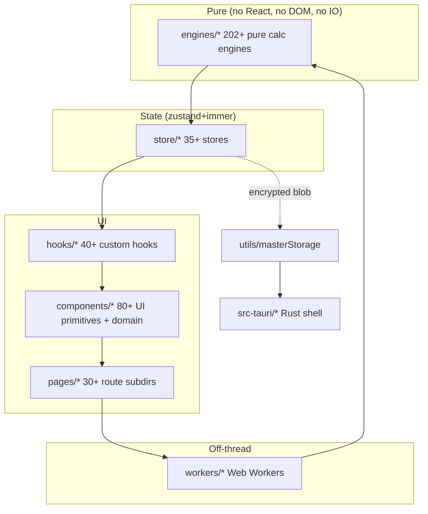

<!-- DRAFT v0.1 — formalize from drafts/ONBOARDING.md v0.5 + 11-ADR set — Mnemosyne 2026-06-13 -->

# FinPlan Pro — Onboarding (Day 1)

> **Audience:** a brand-new engineer (or an LLM agent) opening this repo
> for the first time. Should take ~30 minutes to read end-to-end. If you
> finish in less, you skimmed - go back and read §2 and §4 carefully.

## §1 — Welcome + Mission

FinPlan Pro is an **offline-first FP&A desktop app** for mid-market
finance teams (CFO / Controller / VP Finance, see
`docs/drafts/iris/PERSONAS.md`). It runs as a Tauri desktop shell with
React 19 + TypeScript strict + Vite 7 + Tailwind 4 + Zustand/Immer + AG
Grid + Recharts; a browser-only fallback exists for the demo.

**The mission** is to give a CFO a "spreadsheet-caliber" FP&A workflow
(budgets, scenarios, Monte Carlo, variance, drill-down) that is **100 %
local-first** — your data never leaves the machine unless you explicitly
sync to a backend. This is a real product differentiator vs. Anaplan
($100K+/yr, cloud-only) and Pigment (cloud-only, $30K/yr).

**What this codebase is NOT:** a generic CRUD app. The product is
opinionated about financial workflows (chart-of-accounts, dimensional
modeling, GAAP/IFRS statements, FP&A terminology). If you've never
shipped a financial product, read `docs/GLOSSARY.md` first (20 minutes
well spent).

## §2 — Repo Map

The canonical 14-directory layout (per `AGENTS.md` §"Architecture"):

| Directory         | What lives here                                                    | Why                                                                       |
| ----------------- | ------------------------------------------------------------------ | ------------------------------------------------------------------------- |
| `src/main.tsx`    | App entry                                                          | Bootstraps React, registers Tauri, hydrates masterStorage                  |
| `src/App.tsx`     | All routes (lazy-loaded)                                           | Single source of truth for the SPA's route table                          |
| `src/store/`      | 35+ Zustand stores                                                 | Domain state (auth, budget, scenario, cube, ui, …)                        |
| `src/engines/`    | 202+ pure calculation engines                                      | Financial logic (NPV, IRR, Monte Carlo, OLAP, consolidation) — **no side effects** |
| `src/pages/`      | 30+ route subdirectories                                           | All `React.lazy()` for code-splitting (saves ~48 kB gzip on cold start)  |
| `src/components/ui/` | 80+ atomic UI primitives                                        | Barrel-exported via `index.ts`; design tokens live in `src/config/`       |
| `src/components/` | Domain components (`budget/`, `reports/`, `analytics/`, …)         | Higher-level assemblies; one folder per FP&A workflow                     |
| `src/hooks/`      | 40+ custom hooks (`use` prefix)                                    | Cross-cutting logic (auth, debounce, keyboard shortcuts)                  |
| `src/workers/`    | Web Workers (Monte Carlo, consolidation, formulas)                 | Heavy compute off the main thread                                         |
| `src/services/`   | API layer, WebSocket, collaboration                                | The only place that talks to the network                                  |
| `src/plugins/`    | Plugin system (registry, sandbox, marketplace)                     | Extensibility hook for power users                                         |
| `src/utils/`      | Formatters, calculations, storage, encryption                      | Pure helpers; `masterStorage.ts` and `crypto.ts` are the load-bearing ones |
| `src/config/`     | Design tokens, keyboard shortcuts, sector configs                  | Single source for theme, palette, sector-specific business rules         |
| `src/types/`      | Shared TS types                                                    | Cross-domain interfaces                                                    |
| `src/templates/`  | Report / budget templates                                          | JSON templates the ReportBuilder consumes                                 |
| `src/test/`       | Test setup, mocks, utilities                                       | Vitest setup, `__mocks__/`, render helper                                  |
| `src-tauri/`      | Tauri desktop shell (Rust)                                         | Native window, IPC, filesystem                                             |

**The "load-bearing" files** you must read in your first week:
`src/utils/masterStorage.ts` (encrypted state persistence),
`src/store/authStore.ts` (auth state machine), `src/engines/CubeEngine.ts`
(the OLAP engine), `src/workers/monte-carlo.worker.ts` (the Monte Carlo
worker), and `src/test/setup.ts` (test bootstrap).

## §3 — Dev Environment Setup

```bash
# 1. Install Node 22 (we pin to LTS)
nvm install 22 && nvm use 22          # or use the .nvmrc in the repo

# 2. Install deps
npm ci                                 # exact versions from package-lock.json

# 3. Copy the env template
cp .env.example .env.local             # see AGENTS.md §"Build & Deploy" for keys

# 4. Run the dev server (Vite, browser-only mode)
npm run dev                            # → http://localhost:5173 (strictPort)

# 5. Run the Tauri desktop shell (optional, needs Rust toolchain)
npm run tauri:dev                      # → native window with IPC
```

**Time:** ~10 minutes from `git clone` to a working dev server.

**Pitfalls** (per Hephaestus's audit, all P0/P1):
- Don't use `npm install` — `npm ci` is the contract (lockfile integrity).
- Don't commit `.env.local` — the `.env*` glob in `.gitignore:19` ignores
  it, but the API keys are real (`VITE_NIM_API_KEY`). See ADR-007
  (encryption-at-rest) and ADR-012 (data-storage-scoping).
- Don't skip `npx tsc --noEmit` — TypeScript strict + `noUnusedLocals`
  catches real bugs (e.g. Apollo's P0 #0 was a mock that lied about the
  WorkerPool API).
- Don't run `npm run test` without the 80 GB heap (`--max-old-space-size=81920` is in the `package.json` script). Workers will OOM on the full 8,350+ test suite.

## §4 — Architecture Overview

The app is a **layered SPA**: Engines (pure) → Stores (state) → Hooks
(derived) → Components (UI) → Pages (routes). The strict layer order
means engines know nothing about React, stores know nothing about the
DOM, components know nothing about persistence.



For the full architecture (sequence diagrams, data flow, plugin
extension points, security model) see `docs/ARCHITECTURE.md`. The 11
ADRs that pin the architectural decisions live in `docs/drafts/adr/`:

- **002** zustand-state-management · **003** olap-cube-data-model ·
  **004** decimal-js-currency-precision · **005** custom-masterstorage
- **006** data-retention · **007** encryption-at-rest ·
  **008** audit-logging · **009** incident-response
- **010** schema-migration-strategy · **011** plugin-sandbox-ast ·
  **012** data-storage-scoping

## §5 — The 11-Muse Roster

We ship with an 11-agent "Muse" orchestration layer (per
`docs/drafts/MUSE_LINEUP_v2.md` + `docs/drafts/TASKBOARD.md`). You don't
talk to them directly; the **Leader** assigns work and the **Themis**
monitor pings you if you go idle. But it's useful to know who owns
which lane so you can read their drafts in `docs/drafts/<muse>/`:

| #  | Muse           | Lane                                        | Slot prefix |
| -- | -------------- | ------------------------------------------- | ----------- |
| 0  | **Leader**     | Coordination & strategy                     | `019ebcaa`  |
| 1  | **Apollo**     | Build & ship (stages, commits, push)        | `019ebcc3-...dca` |
| 2  | **Athena**     | Code perfectionist (audit, review, validate)| `019ebcc3-...1de` |
| 3  | **Prometheus** | Performance & test (bundle, render, workers)| `019ebcc7-...cf07` |
| 4  | **Hera**       | UX, a11y, design system                     | `019ebcc7-...58c8` |
| 5  | **Hephaestus** | Security, data integrity, compliance (SOC 2)| `019ebcd6-...20a0` |
| 6  | **Mnemosyne**  | Documentation, architecture, JSDoc, ADRs    | `019ebcd6-...5bed` (you are here) |
| 7  | **Strategos**  | Product strategy, competitive intel, GTM    | `019ebd9a-...7284` |
| 8  | **Iris**       | Customer & user research, NPS, personas    | `019ebd9c-...161e` |
| 9  | **Hermes**     | Marketing, sales, GTM enablement           | `019ebd9c-...6e18` |
| 10 | **Atlas**      | DevOps, infra, observability, CI           | `019ebd9c-...33ba` |
| 11 | **Themis**     | Orchestration & work-protocol monitor      | `019ebda3-...b72e` |

**Your first PR will land in Athena's audit queue** (she reviews every
PR for dead code, `as any` casts, missing `useEffect` cleanups, a11y
spot-checks). Read `docs/drafts/athena/audit-pattern.md` to see what
she flags.

## §6 — Common Tasks

### 6.1 Add a new page

1. Create `src/pages/<domain>/<PageName>Page.tsx` (default export, named
   `<PageName>Page`).
2. Register the route in `src/App.tsx` (lazy-loaded, wrap in
   `<ErrorBoundary>`).
3. If the page needs a new store, follow §6.3; if a new engine, §6.2.
4. Add a colocated test: `<PageName>Page.test.tsx` (see `docs/TESTING.md`).
5. Add a JSDoc header to the page export (see
   `docs/drafts/mnemosyne/jsdoc-p0/README.md` for the template).

### 6.2 Add a new engine

1. Create `src/engines/<Domain>Engine.ts` (named export, class with
   static methods, **no side effects**).
2. File size limit: **500 lines** (per `AGENTS.md` §"Code Conventions").
3. Add a colocated test: `<Domain>Engine.test.ts` (engines target
   ≥ 85 % coverage per `docs/TESTING.md` §6).
4. Add a JSDoc header (template in the jsdoc-p0/ docs).
5. Reference the engine from your store / worker / page; never call
   engines directly from React components.

### 6.3 Add a new store

1. Create `src/store/<domain>Store.ts` using the **canonical Zustand
   pattern** (per `AGENTS.md` §"Zustand Store Pattern"):
   ```ts
   import { create } from 'zustand';
   import { subscribeWithSelector } from 'zustand/middleware';
   import { persist } from 'zustand/middleware';
   import { immer } from 'zustand/middleware/immer';
   import { masterStorage } from '@/utils/masterStorage';
   export const useFooStore = create<FooState>()(
     subscribeWithSelector(
       persist(
         immer((set, get) => ({ /* state + actions */ })),
         { name: 'foo', storage: masterStorage }
       )
     )
   );
   ```
2. Transient stores (no persist) skip the `persist` wrapper.
3. Add `useFooStore.test.ts` (100 % coverage target per
   `docs/TESTING.md` §6) and reset state in `beforeEach` via
   `useFooStore.setState({ ...initialState })`.
4. If the store has class-instance fields (e.g. `engine`), `partialize`
   them out of persistence.

### 6.4 Add a new ADR

1. Copy the template at `docs/drafts/adr/README.md` (Context, Decision,
   Consequences, Alternatives, Compliance, Status, Date).
2. File name: `ADR-NNN-kebab-case-slug.md`. The current set lives in
   002-012; the next free number is **013**. Before you use it, check
   `docs/drafts/adr/` and `docs/STRATEGIC_DECISIONS_LOG.md` for the
   most recent decision number.
3. If the ADR supersedes an earlier one, mark the earlier ADR
   **Status: Superseded by ADR-NNN**.
4. Cross-link the new ADR from `docs/ARCHITECTURE.md` §"Decisions
   pinned by ADRs".
5. Submit a PR; Hephaestus reviews ADRs for SOC 2 / ISO 27001 / GDPR
   impact (see `docs/drafts/hephaestus/SOC2_READINESS.md`).

## §7 — Cross-References

- **Glossary (FP&A terms)** — `docs/GLOSSARY.md` (25 terms: ARR, NPV,
  Monte Carlo, OLAP, …).
- **AGENTS.md (this repo's agent instructions)** — `AGENTS.md` (path
  aliases, store pattern, code conventions, testing).
- **FINPLAN_PERFECTION_PLAN.md (roadmap + scorecard)** —
  `FINPLAN_PERFECTION_PLAN.md` (the 6-phase roadmap that drove the
  Muse system; out of date by 1 quarter, treat as historical).
- **Taskboard (current cycle)** — `docs/drafts/TASKBOARD.md`
  (the 11-Muse roster, in-flight tasks, ready queue).
- **Strategic corpus** — `docs/STRATEGIC_DECISIONS_LOG.md` (D-NNN
  numbered decisions, the cycle's source of truth for "why we did X").
- **Architecture** — `docs/ARCHITECTURE.md` (Mermaid diagrams, data
  flow, security model).
- **Compliance evidence** — `docs/security-deferrals.md` (3-deferral
  ownership map; see also `docs/TESTING.md` §9 for the audit trail).

## §8 — First PR Walkthrough

```bash
# 1. Branch from main; name it <muse-or-your-name>/<short-kebab-slug>
git checkout main && git pull
git checkout -b mnemosyne/jsdoc-p0-useauth-01

# 2. Make the change. Commit in logical chunks (one per concern).
git add src/hooks/useAuth.ts
git commit -m "docs(jsdoc): add P0 JSDoc to useAuth hook (T-MN-004)"

# 3. The 6-stage CI will run on your push:
#    Stage 1  tsc --noEmit                  (must be 0)
#    Stage 2  eslint --fix                   (must be 0/0)
#    Stage 3  npx vitest run --coverage      (must be ≥ 0 fail)
#    Stage 4  npx tsc --noEmit + build       (must be 0 + bundle < 150KB gzip main)
#    Stage 5  npm audit --omit=dev           (must be 0 CVEs)
#    Stage 6  bundle-size check              (main < 150KB gzip, total < 2MB gzip)

# 4. Push and open a PR with the standard template
git push -u origin HEAD
#  → use the PR template; reference the task ID (T-MN-004);
#    Athena (code perfectionist) is auto-assigned as reviewer.
```

**The first commit is the hardest.** Subsequent commits are copy-paste
of the same pattern. If a CI stage fails, **read the error** — the most
common ones are:

- **Stage 1 (tsc)** — usually a type-narrowing issue, fix with
  `as const` or a discriminated union.
- **Stage 2 (lint)** — usually `react-hooks/exhaustive-deps` or
  `jsx-a11y/label-has-associated-control`; the warning messages tell
  you which file:line.
- **Stage 3 (test)** — read `docs/TESTING.md` §10 (Common Pitfalls) for
  the 5 failure patterns. If you see `Test setup was unable to find a
  WorkerPool mock`, you hit Apollo's P0 #0 — the mock is in
  `src/test/setup.ts:89` and is wrong.
- **Stage 4 (build)** — usually a missing import or a circular
  dependency. `madge --circular src/` is the diagnostic.
- **Stage 5 (audit)** — usually a transitive dep got a CVE; check
  `npm audit` output and pin or replace.
- **Stage 6 (bundle)** — usually a new heavy dep; lazy-load it
  (`React.lazy(() => import('...'))`) and check the dynamic import
  shows up in the chunks manifest.

**Welcome aboard.** Ping Mnemosyne (`019ebcd6-43a4-7ea0-bf4f-22382c665bed`)
or the Leader if anything in this doc is wrong — the on-disk source
is the source of truth, this doc is the friendly map.

<!-- /DRAFT v0.1 — Mnemosyne 2026-06-13 -->
