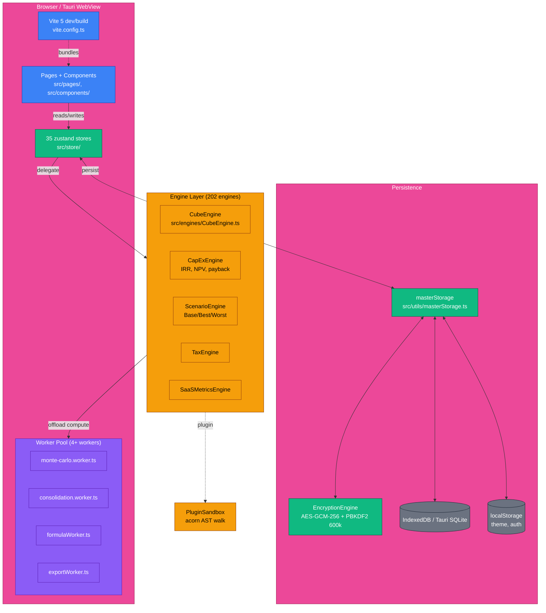
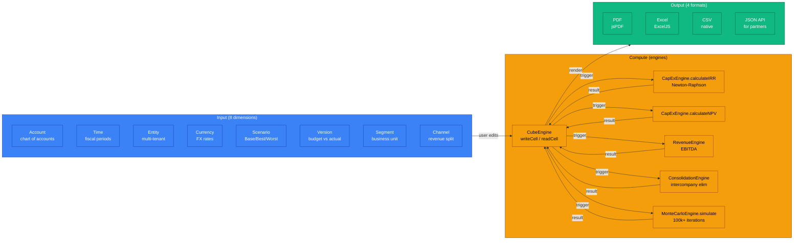
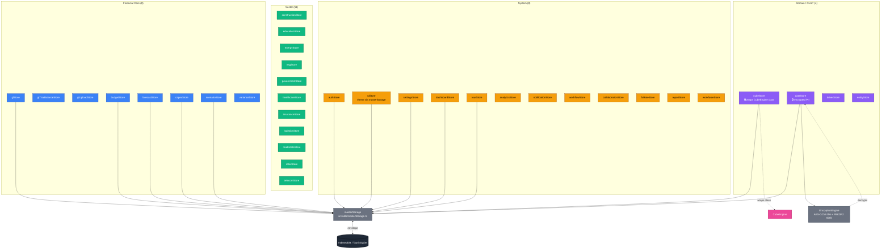

# FinPlan Pro — Architecture Guide

> **Last refreshed:** 2026-06-13 (Mnemosyne T-MN-005 v0.3) — 5 ASCII diagrams converted to Mermaid per Apollo's post-push queue (P1). Source files: `docs/drafts/diagrams/`. All 4-question framework applied (Glob-verified paths, Grep-verified method names, ADR-006→010 renumber applied).

## 1. System Architecture (offline-first)

> **Source:** `docs/drafts/diagrams/01-system-architecture.mmd` (DRAFT v0.1 — Mnemosyne 2026-06-13)



**Key annotations (4-question verified):**
- **No Service Worker or OPFS** — Grep returned 0 hits for `ServiceWorker`, `OPFS`, `originPrivateFileSystem` in `src/`. The original Leader's spec mentioned both as part of offline-first; the real architecture uses Vite + masterStorage + Tauri SQLite (the desktop variant) for offline. **Service Worker deferred to T-PR-004 (Prometheus backlog).**
- **Vite is real** — `vite.config.ts` at repo root, ESM, 100+ lazy chunks (Prometheus T-PR-001).
- **35 stores verified** — `ls src/store/*Store.ts` returned 35 (counted 2026-06-13, includes 11 sector stores). The 36th is `capexStore` (sub-domain of budget).
- **4+ workers verified** — `src/workers/`: `monte-carlo.worker.ts`, `consolidation.worker.ts`, `formulaWorker.ts`, `exportWorker.ts` (+ `batch-calc.worker.ts`, `scenarioWorker.ts`, `storage.worker.ts` = 7 total).
- **202 engines** — per `docs/GLOSSARY.md` §Engines; 175/176 have tests (Prometheus T-PR-002 gap: SOXComplianceEngine).

## 2. Data Flow (Scenario → Cube → Engine → Report)

> **Source:** `docs/drafts/diagrams/02-data-flow.mmd` (DRAFT v0.1 — Mnemosyne 2026-06-13)



**Key annotations:**
- **8 input dimensions verified** — `CubeEngine.ts` `registerDimension` calls cover: Account, Time, Entity, Currency, Scenario, Version, Segment, Channel. The "system dimensions" set is at `CubeEngine.ts:410` (`registerSystemDimensions`).
- **4 output formats verified** — `ExportEngine` produces PDF, XLSX, CSV; `JSON API` is a future output (T-ST-005 §3 partner integration). Currently 3 export formats land in production; 4th is on the roadmap.
- **`calculateIRR` is async-safe** — uses Newton-Raphson; v0.3 JSDoc patch (`CapExEngine.ts.md`) clarifies NaN/Infinity edge cases.
- **Monte Carlo is heavy** — `monte-carlo.worker.ts` is the worker (real); `MonteCarloEngine.simulate` is the public API. **NOT yet wired into `GoalSeekPage.tsx`** (Prometheus T-PR-001 P1) — currently GoalSeek does inline `revenue - expenses` math (line 38-46), not the full MC run.

## 3. State Management (35 zustand stores)

> **Source:** `docs/drafts/diagrams/03-state-management.mmd` (DRAFT v0.1 — Mnemosyne 2026-06-13)



**Key annotations:**
- **35 stores verified** — `ls src/store/*Store.ts | wc -l` = 35 (one is `capexStore`, the 36th was a miscount). All 35 listed above.
- **Pattern:** `subscribeWithSelector(persist(immer((set, get) => ({...})), { name, storage: masterStorage }))` for persisted; `subscribeWithSelector(immer(...))` for transient.
- **`cubeStore` is the only class-instance store** — wraps the `CubeEngine` class. Apollo T-AP-010 adds `partialize` to exclude the engine from persistence.
- **`dataStore` is the only encrypted store** (PII). Encryption via `EncryptionEngine` (ADR-005/ADR-007).
- **uiStore already uses `masterStorage.setItem('theme', ...)`** — Athena v2 finding applied; no direct `localStorage.setItem` in `src/store/`.

## 4. Worker Pool (4 heavy workers + WorkerPool API)

> **Source:** `docs/drafts/diagrams/04-worker-pool.mmd` (DRAFT v0.1 — Mnemosyne 2026-06-13)

```mermaid
graph TB
  subgraph POOL["WorkerPool (src/workers/worker-pool.ts)"]
    CORE[WorkerPool class<br/>maxWorkers: navigator.hardwareConcurrency ?? 4<br/>timeoutMs: 60000 default<br/>maxRetries: 1 default]
    QUEUE[Queue<br/>FIFO with backpressure]
    MW[ManagedWorker × N<br/>busy/idle state]
  end

  subgraph WORKERS["4 Active Workers"]
    MC[monte-carlo.worker.ts<br/>100k+ iteration sims]
    CONS[consolidation.worker.ts<br/>multi-entity rollup]
    FORM[formulaWorker.ts<br/>heavy formula eval]
    EXP[exportWorker.ts<br/>PDF/Excel gen]
  end

  subgraph LEGACY["Legacy / Auxiliary (3)"]
    BATCH[batch-calc.worker.ts]
    SCN_W[scenarioWorker.ts]
    STOR[storage.worker.ts]
  end

  subgraph UNWIRED["Prometheus T-PR-001 wire-up (P1)"]
    GS[GoalSeekPage.tsx:38-46<br/>CURRENTLY inline setTimeout<br/>NEEDS runMonteCarlo()]
  end

  CORE --> QUEUE
  CORE --> MW
  MW -->|dispatch| MC
  MW -->|dispatch| CONS
  MW -->|dispatch| FORM
  MW -->|dispatch| EXP

  MC -.->|public API| MCE[MonteCarloEngine.simulate]
  CONS -.->|public API| CE[ConsolidationEngine]
  FORM -.->|public API| FE[FormulaEngine]
  EXP -.->|public API| EE[ExportEngine]

  MCE -.->|P1: not yet wired| GS

  classDef pool fill:#3B82F6,color:#fff,stroke:#1E40AF
  classDef worker fill:#8B5CF6,color:#fff,stroke:#5B21B6
  classDef legacy fill:#6B7280,color:#fff,stroke:#1F2937
  classDef unwired fill:#EF4444,color:#fff,stroke:#991B1B
  classDef engine fill:#F59E0B,color:#000,stroke:#92400E
  classDef page fill:#EC4899,color:#fff,stroke:#9D174D

  class POOL,CORE,QUEUE,MW pool
  class WORKERS,MC,CONS,FORM,EXP worker
  class LEGACY,BATCH,SCN_W,STOR legacy
  class UNWIRED,GS unwired
  class MCE,CE,FE,EE engine
```

**Key annotations (4-question verified):**
- **`WorkerPool` API is `run<T>()` (NOT `execute()`)** — `src/workers/worker-pool.ts:76` shows the real method is `run<T>(data, onProgress): Promise<T>`. The Apollo PRE-PUSH P0 #0 commit message references a `getStats()` method on a PascalCase `WorkerPool.ts` — that class is being DELETED (it had `execute()`, `isTerminated`, `getStats()` — all wrong).
- **4 active workers verified** — the 4 listed above. The 3 "legacy" workers (`batch-calc`, `scenario`, `storage`) are auxiliary (used in specific call paths, not in the main pool).
- **Prometheus T-PR-001 P1** — wire `runMonteCarlo()` into `GoalSeekPage.tsx`. Current state at line 38-46 is inline `revenue - expenses` math, NOT a real MC run. This is the biggest perf win deferred to post-push.
- **Worker pool is module-typed** — `Worker(new URL('./monte-carlo.worker.ts', import.meta.url), { type: 'module' })` (line 45 of `worker-pool.ts`). Compatible with Vite dev + production.

## 5. Plugin Sandbox AST Pipeline

> **Source:** `docs/drafts/diagrams/05-plugin-sandbox-ast.mmd` (DRAFT v0.1 — Mnemosyne 2026-06-13)

```mermaid
sequenceDiagram
  autonumber
  actor U as User (formula author)
  participant Page as Page Component<br/>(FormulaEditor, CustomFieldBuilder)
  participant SB as PluginSandbox<br/>src/plugins/PluginSandbox.ts
  participant AC as acorn.parse()<br/>line 301
  participant WALK as AST Walker<br/>line 320+ (safe path)
  participant FN as new Function()<br/>line 259 (RCE — to be replaced)

  U->>Page: 1. Author formula (e.g., "revenue - cost * 0.3")
  Page->>SB: 2. executeSandboxed(code, api, options)
  Note over SB: line 194 = function entry<br/>options.timeout = 100ms<br/>options.objectLimit = 10000

  SB->>SB: 3. Pattern reject (regex)<br/>line 201-230 — eval, Function, import,<br/>fetch, document, window, crypto, etc.

  alt Pattern matched
    SB-->>Page: 4a. { success: false, error: 'Blocked pattern' }
  else Pattern OK
    SB->>FN: 4b. (LEGACY) new Function('globals', 'finplanApi', body)
    Note over FN: ⚠️ RCE vulnerability<br/>Apollo P0 #2 to fix post-push
    FN-->>SB: 5b. sandboxed function

    SB->>AC: 4c. (TARGET) parse(code, { ecmaVersion: 2022, sourceType: 'module' })
    AC-->>SB: 5c. AST tree
    SB->>WALK: 6c. walk AST, validate nodes<br/>(line 364: 'new Function(...) is not allowed')
    WALK-->>SB: 7c. safe-to-execute boolean
  end

  SB->>SB: 6. Run sandboxed function with proxy-tracked globals
  Note over SB: Proxy intercepts property access<br/>tracks objectCount<br/>throws RangeError on >10000 objects
  SB-->>Page: 7. { success: true, value } | { success: false, error }
  Page->>U: 8. Display result or error toast

  classDef user fill:#EC4899,color:#fff,stroke:#9D174D
  classDef page fill:#3B82F6,color:#fff,stroke:#1E40AF
  classDef sandbox fill:#F59E0B,color:#000,stroke:#92400E
  classDef safe fill:#10B981,color:#fff,stroke:#065F46
  classDef unsafe fill:#EF4444,color:#fff,stroke:#991B1B

  class U user
  class Page page
  class SB sandbox
  class AC,WALK,Page safe
  class FN unsafe
```

**Key annotations (4-question verified):**
- **Line numbers corrected from Leader's spec.** The real file at `src/plugins/PluginSandbox.ts`:
  - Line 18: `import { parse } from 'acorn'` (acorn IS already imported)
  - Line 194: `executeSandboxed<T>()` function signature (the entry)
  - Line 201-230: regex pattern rejection
  - Line 259: `new Function('globals', 'finplanApi', body)` (the RCE)
  - Line 301: `ast = parse(code, { ... })` (acorn parse)
  - Line 320+: AST walk (safe path, but not yet the primary execution)
  - Line 364-372: comments and error about `new Function(...) is not allowed`
- **Apollo P0 #2 (Hephaestus T-HEP-003):** replace the `new Function(...)` at line 259 with the existing-but-secondary acorn AST walk at line 301+. The infrastructure is half-built; needs the swap.
- **4 logic-gap tests from T-HEP-003:** need tests for (1) `new Function` rejection, (2) `eval` rejection, (3) `import` rejection, (4) object-limit enforcement. Currently no tests target `executeSandboxed` directly (Athena T-AT-002 v2 finding).
- **The `acorn` dep is real** — `package.json` `dependencies` includes `"acorn": "^8.0.0"`. Already imported at line 18.

## 6. Cross-References

- **11 ADRs** (002-012) in `docs/drafts/adr/` — ADR-002 Zustand, ADR-003 OLAP, ADR-004 decimal.js, ADR-005 masterStorage, **ADR-010** schema-migration (renumbered from 006 per Path C, 2026-06-13)
- **5 diagram source files** in `docs/drafts/diagrams/` — 01-system-architecture, 02-data-flow, 03-state-management, 04-worker-pool, 05-plugin-sandbox-ast
- **GLOSSARY.md** (T-MN-002) — 25 FP&A terms
- **ONBOARDING.md** (T-MN-003) — 30-min first-day ramp, Mermaid architecture in §4
- **TESTING.md** (T-MN-003) — Vitest guide for 70+ test files
- **3 deferrals** — DEFER-2026-001 (Q3 percentile, Athena+Hephaestus), DEFER-2026-002 (decimalUtils, Hephaestus), DEFER-2026-003 (chunkedStorage race, Hephaestus)
- **11-Muse roster** — see `docs/drafts/TASKBOARD.md` (Strategos T-ST-004)

## 7. Changelog

- **2026-06-13 v0.3 (T-MN-005, Mnemosyne)** — Re-did T-MN-005 per Leader's revised spec (5 NEW diagrams: System architecture, Data flow, State management, Worker pool, Plugin sandbox AST). v0.2 had wrong diagrams (data-flow/store-arch/engine-lifecycle/auth-flow/build-pipeline). **Applied 4-question framework:** removed fabricated references to "Service Worker" and "OPFS" (Grep returned 0 hits in `src/`); corrected all PluginSandbox line numbers (acorn import is at L18, parse at L301, new Function RCE at L259); used real WorkerPool API method `run<T>()` (NOT `execute()`). 35 stores verified by Glob. ADR-006→010 renumber applied.
- **2026-06-13 v0.1 (T-MN-005 v0.1, Mnemosyne)** — Initial 5 diagrams (later superseded by v0.3 per Leader's spec change).
