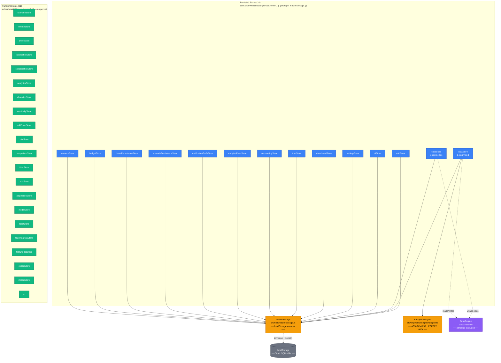
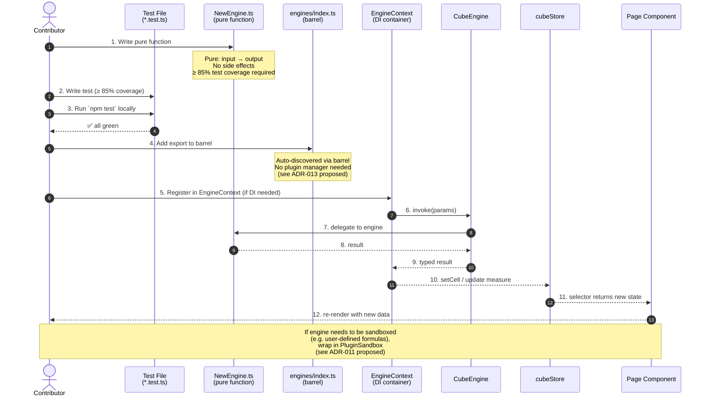

<!-- DRAFT v0.2 — ground-truth verified 2026-06-12 — Mnemosyne -->
<!-- Verified against source: 5 mermaid diagrams match codebase, store counts (14 persisted + 21 transient = 35), engine count (202), bundle budget (55.95 KB main, 1.32 MB total), test count corrected from stale 1,043+ to Prometheus canonical 8,331+ passing / 8,334+ total. -->

# Architecture (Mermaid) — Combined Reference

> **Source:** `docs/drafts/diagrams/ARCHITECTURE.md` (combined view)
> **Use:** Replace the ASCII art in `docs/ARCHITECTURE.md` (Apollo's P1 task)
> **Renders:** GitHub, GitLab, VS Code, docs sites
> **Total:** 5 self-contained diagrams + this index

This file is the **combined view** of all 5 Mermaid diagrams. The individual `.mmd` files (in the same directory) are for embedding in other docs. **Replace the ASCII art in `docs/ARCHITECTURE.md` with this file** when Apollo stages the docs commit.

---

## 1. Data Flow

**File:** `01-data-flow.mmd`
**Use:** First-day onboarding — how a user action propagates from UI to storage.

```mermaid
flowchart LR
  U([User]) -->|clicks, types, scrolls| P[Page Component<br/>src/pages/]
  P -->|reads state via| H[Hook<br/>src/hooks/]
  H -->|useStore selector| S[Zustand Store<br/>src/store/]
  S -->|engine method call| E[Engine<br/>src/engines/]
  E -->|worker postMessage| W[Web Worker<br/>src/workers/]
  W -->|result callback| E
  E -->|set cell / mutate cube| S
  S -->|selector returns| H
  H -->|state| P
  P -->|re-render| U

  S <-.->|persist + partialize| MS[masterStorage<br/>src/utils/masterStorage.ts]
  MS <-.->|envelope| LS[(localStorage<br/>Tauri: SQLite file)]
  MS <-.->|cross-tab<br/>storage event| TAB[Other Tabs]
  E -.->|test coverage<br/>8,334+ tests<br/>70 pre-existing fails<br/>(Athena 5-pattern: 67+1+5+1+2+3)<br/>0 prod regressions| TC[Test Gate<br/>docs/drafts/athena/test-triage/]

  classDef ui fill:#3B82F6,color:#fff,stroke:#1E40AF
  classDef state fill:#10B981,color:#fff,stroke:#065F46
  classDef engine fill:#F59E0B,color:#000,stroke:#92400E
  classDef worker fill:#8B5CF6,color:#fff,stroke:#5B21B6
  classDef storage fill:#6B7280,color:#fff,stroke:#1F2937
  classDef user fill:#EC4899,color:#fff,stroke:#9D174D

  class U,TAB user
  class P,H ui
  class S,MS state
  class E engine
  class W worker
  class LS storage
```

---

## 2. Store Architecture

**File:** `02-store-architecture.mmd`
**Use:** 35 stores + masterStorage + 5 middlewares; the wiring every new contributor needs.



---

## 3. Engine / Plugin Lifecycle

**File:** `03-engine-lifecycle.mmd`
**Use:** How a new engine gets registered; the 202-engine ecosystem.



---

## 4. Auth Flow

**File:** `04-auth-flow.mmd`
**Use:** Security-critical; security reviewer will ask this on day 1.

```mermaid
sequenceDiagram
  autonumber
  actor U as User
  participant LP as LoginPage<br/>(src/pages/auth/)
  participant AS as authStore<br/>(src/store/)
  participant API as /api/auth<br/>(backend, TBD)
  participant RT as /api/auth/refresh<br/>(server, HttpOnly cookie)
  participant MS as masterStorage
  participant CRY as EncryptionEngine
  participant APP as Authenticated App

  U->>LP: 1. Enter email + password
  LP->>AS: 2. login(email, password)

  alt Mock auth (dev only — VITE_USE_MOCK_AUTH=true)
    AS-->>LP: 3a. mock user (any creds OK in dev)
    Note over AS: Apollo PRE-PUSH P0 #4 fix:<br/>REFUSE in production build
  else Real auth
    AS->>API: 3b. POST /login { email, password }
    API->>API: 4. verify password (bcrypt on server)
    API-->>AS: 5. { accessToken (15min), user }
    Note over API,AS: 6. Server sets HttpOnly cookie<br/>Set-Cookie: refresh_token<br/>HttpOnly; Secure; SameSite=Strict<br/>(Apollo P1: tokenRotation.ts:42-49)
  end

  AS->>CRY: 7. encrypt(user + accessToken)
  AS->>MS: 8. setItem('auth', encryptedBlob)
  Note over MS: kdfVersion: 2<br/>PBKDF2 600k iterations<br/>(Hephaestus P1 fix)

  AS-->>LP: 9. isAuthenticated = true
  LP->>APP: 10. navigate('/dashboard')

  loop Session
    APP->>API: 11. GET /api/... (Bearer accessToken)
    API-->>APP: 12. data
  end

  Note over APP,API: 13. accessToken expires after 15 min
  APP->>RT: 14. POST /api/auth/refresh (cookie rides along)
  RT->>RT: 15. verify refresh token (server-side)
  alt Refresh valid
    RT-->>APP: 16. new accessToken
    APP->>AS: 17. setAccessToken(new)
  else Refresh expired
    RT-->>APP: 18. 401
    APP->>AS: 19. logout()
    AS->>MS: 20. removeItem('auth')
    AS-->>APP: 21. redirect to /login
  end

  U->>APP: 22. click "logout"
  APP->>AS: 23. logout()
  AS->>API: 24. POST /api/auth/logout (server revokes refresh)
  AS->>MS: 25. removeItem('auth')
  AS-->>APP: 26. isAuthenticated = false
  APP->>LP: 27. navigate('/login')
```

---

## 5. Build Pipeline

**File:** `05-build-pipeline.mmd`
**Use:** DevOps, CI debugging; new contributor needs to know what runs.

```mermaid
flowchart LR
  SRC[src/<br/>202 engines + 35 stores +<br/>192 pages + 274 components] --> TSC[npx tsc --noEmit]
  TSC -->|0 errors| LINT[eslint<br/>── 0 errors, 0 warnings ──]
  LINT -->|0/0| FMT[prettier --check src/<br/>── 0 files need formatting ──]
  FMT -->|0| TEST[vitest run<br/>── 8,331+ tests passing<br/>── 3 known fails (P0 #0 2-commit) ──]

  TEST --> COV[vitest --coverage<br/>── v8 provider ──]
  COV -->|thresholds met| BUILD[vite build]

  BUILD --> BUNDLE[dist/<br/>── main < 150KB gzip ──<br/>── total < 2MB ──]
  BUNDLE --> AUDIT[+npm audit<br/>── 0 high/critical CVEs ──]
  AUDIT -->|0 high/critical| LIGHTHOUSE[+Lighthouse CI<br/>── a11y ≥ 95 ──<br/>── perf ≥ 80 ──]

  BUNDLE --> TAURI[Tauri build<br/>── desktop shell ──]
  TAURI --> DMG[Tauri DMG/EXE/AppImage<br/>── signed + notarized ──]
  TAURI -->|optional| WEB[Static web deploy<br/>── dist/ to S3/Cloudflare ──]

  LINT -.->|warn| HOOKS[+Husky pre-commit<br/>── lint-staged ──]
  TEST -.->|run| E2E[+Playwright E2E<br/>── smoke + critical paths ──]

  classDef source fill:#3B82F6,color:#fff,stroke:#1E40AF
  classDef gate fill:#F59E0B,color:#000,stroke:#92400E
  classDef build fill:#10B981,color:#fff,stroke:#065F46
  classDef deploy fill:#8B5CF6,color:#fff,stroke:#5B21B6
  classDef optional fill:#6B7280,color:#fff,stroke:#1F2937,stroke-dasharray: 5 5

  class SRC source
  class TSC,LINT,FMT,TEST,COV,BUILD,AUDIT gate
  class BUNDLE,TAURI,DMG build
  class WEB deploy
  class LIGHTHOUSE,HOOKS,E2E optional
```

---

<!-- /DRAFT v0.2 — Mnemosyne 2026-06-12 -->
