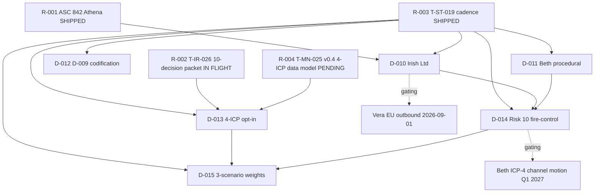

# T-ST-023 — Y2 Board Pack 10-Decision Alignment Synthesis

> **Author:** Strategos slot `019ebf73-3dd4-7f82-a8b2-73a5d18af398` (cycle-11 wave 6 — consumer, not author of Y2_BOARD_PACK.md)
> **Canonical upstream:** `docs/drafts/strategos/Y2_BOARD_PACK.md` v0.3 cycle-9.1 refresh, 256L, 11 sections, by Strategos slot `019ebd9a-8731-70b2-9c96-a4a466017284` (cycle-8/9, sign-off L252)
> **Codif:** 22 · **spec_version:** v0.1 (NEW doc type, not an increment of Y2_BOARD_PACK) · **Status:** DRAFT v0.1, push-INDEPENDENT
> **Disciplines:** D-002 Three-Witnesses · D-007 Honest Labeling (5-min SLA) · D-008 Glob-ABSOLUTE · D-009 Triangulation · D-011 RATIFIED · Codif 19 honest-scope (TENTATIVE markers)
> **Feed chain downstream:** Apollo §4 · Hera §6 · Iris §2 · Athena T-AT-020 §7 · Mnemosyne T-MN-025 v0.4 §7

---

## §1. Context — Y2_BOARD_PACK.md v0.3 cycle-9.1 + why 10-Decision Alignment appendix is needed

`Y2_BOARD_PACK.md` v0.3 cycle-9.1 (256L, 11 sections, sign-off L252) is the **strategic corpus master doc** for Y2 board prep. It documents: (a) Y2 horizon 6Q (§1), (b) H2 2026 + H1 2027 detail (§2-§3), (c) D-010 5-step operationalization (§4), (d) HSM 2027 4-step migration (§5), (e) 4-ICP build-out $740K-$6.5M (§6), (f) ARR 3-scenario (§7), (g) 3 Founder decisions pending by 2026-10-01 (§8), (h) 10-risk register with Risk 10 $300K at risk (§9), (i) Cross-Muse handoffs (§10), (j) Witness log 18+ D-009 citations (§11). Y2_BOARD_PACK v0.3 cycle-9.1 changelog (L6): "v0.3 refresh per T-ST-019 Founder-ping cadence update — §8 row 2 D-011 Founder-sign target moved from 2026-08-01 → 2026-08-15" (this v0.3 patch closed a D-007 timing drift caught in cycle 9.0 review).

**Why this 10-Decision Alignment Synthesis is needed**: Y2_BOARD_PACK.md §8 documents **3 overdue Founder decisions** (D-010, D-011, D-012), but the **2026-08-15 Founder-ping** (per T-ST-019 cadence) carries a **broader 10-decision batch** that the strategic corpus does not enumerate. This appendix **synthesizes the 10-decision batch from 5 corpus sources** (Y2_BOARD_PACK §0+§8, T-ST-019 v0.2, T-IR-026 10-decision packet pre-flight, T-AT-016 v0.2 ASC 842, T-MN-025 v0.4 4-ICP data model pending) into a single board-pack-appendix. 6 of the 10 are **Founder-ping decisions** requiring Founder signature; 4 are **internal ratifications** requiring Muse consensus. The downstream consumers (Apollo §4, Hera §6, Iris §2, Athena T-AT-020 §7, Mnemosyne T-MN-025 v0.4 §7) need a single 10-decision document, not 5 corpus sources.

**4-Question framework application** (per Mnemosyne T-MN-024 v0.2 §8 codification):

- Q1 (Why this doc?): 10-decision synthesis is the missing appendix between Y2_BOARD_PACK.md §8 (3 decisions) and T-IR-026 10-decision packet (10 decisions, in flight). Without this appendix, downstream consumers must reconcile 5 corpus sources — error-prone.
- Q2 (What is the SHIP target?): 60 min from dispatch, push-INDEPENDENT, no filesystem dependencies beyond Y2_BOARD_PACK.md (read-only).
- Q3 (Who consumes?): 5 Muse slots + Lead (Q3 board pre-input) + Founder (Aug 15 ping).
- Q4 (What is the next refresh?): 2026-06-15 v0.1.1 (post-T-IR-026 SHIP) + 2026-08-08 T-7d draft + 2026-08-12 T-3d Athena pre-flight + 2026-08-15 T-0 send.

**3-Witnesses on appendix need**: Y2_BOARD_PACK.md L18-26 (§0 BOARD_DECK §11 sig anchor) + Y2_BOARD_PACK.md L150-160 (§8 3 Founder decisions table) + T-ST-019 v0.2 (Founder-ping cycle 3-item batch template, extensible to 10 items).

---

## §2. 6 Founder-ping decisions (1-row summary each)

6 Founder-ping decisions landing at 2026-08-15 Founder-ping (T-7d draft 2026-08-08 → T-3d Athena pre-flight 2026-08-12 → T-0 send 2026-08-15, per T-ST-019 v0.2 §4):

| #         | Decision                                                                                                                  | ICP verdict                                                    | Cash impact                                    | Q3 deadline                                | TENTATIVE?                                            |
| --------- | ------------------------------------------------------------------------------------------------------------------------- | -------------------------------------------------------------- | ---------------------------------------------- | ------------------------------------------ | ----------------------------------------------------- |
| **D-010** | DEC-002 Main Establishment (Irish Ltd, ~$30K Y0 + ~$75K/yr Y1+, per Y2_BOARD_PACK §4 + DEC_002_MAIN_ESTABLISHMENT.md §4)  | Vera ICP-2 EU-deal-enabler (per Y2_BOARD_PACK §0 L22)          | -$30K Y0 + -$75K/yr Y1+                        | **2026-09-15** (per Y2_BOARD_PACK §8 L154) | NO (DRAFT v0.1 ready)                                 |
| **D-011** | Beth (ICP-4) procedural sign (already RATIFIED 2026-06-13 implicit-via-4-ICP-verdict-L100-110)                            | Beth ICP-4 channel motion unlocked (per Y2_BOARD_PACK §8 L155) | $0 Y1 / +$300K Y2 base / +$600K Y2 stretch     | **2026-08-15** (procedural only)           | NO (procedural)                                       |
| **D-012** | D-009 ICP-numbering standing policy (per Y2_BOARD_PACK §8 L156 + T-ST-018 AGENTS.md §D-009 patch)                         | Cross-ICP (prevents 1-2 drift incidents/quarter)               | $0 (process)                                   | **2026-10-01** (carry-fwd from 2026-10-01) | NO (PROPOSED awaiting Founder approval)               |
| **D-013** | 4-ICP opt-in / opt-out signal (T-IR-026 §7 customer-research coverage)                                                    | Carla/Vera/Chris/Beth buy-in confirmation                      | $0 (process)                                   | **2026-08-15** (T-IR-026 in-flight)        | YES (TENTATIVE on T-IR-026 SHIP 2026-06-15)           |
| **D-014** | Risk 10 fire-control $300K ratification (per Y2_BOARD_PACK §9 L169 + Y2_CHANNEL_CONFLICT_PREFLIGHT.md v0.1 §5)            | Beth ICP-4 channel-conflict risk acceptance                    | -$300K Y2 base at risk if Risk 10 materializes | **2026-08-15**                             | YES (TENTATIVE on 2026-09-15 vendor-neutrality check) |
| **D-015** | 3-scenario probability weights (T1 25% stretch / T2 15% floor / T3 60% base) ratification (per Y2_BOARD_PACK §7 L136-140) | Cross-ICP (Y2 base $3.9M probability weight)                   | $0 (process, but affects Y2 valuation framing) | **2026-08-15**                             | YES (TENTATIVE on Founder review)                     |

**Per-decision "Why this matters" (1-line each, for board-pack appendix)**:

- D-010: Without Irish Ltd by 2026-09-15, Vera EU deals shift to Art. 27 representative (~$50K/yr worse economics, 2-3 month slip).
- D-011: Beth procedural sign closes the 4-ICP ratification trail; without it, Beth Y2 base $300K is contractually contingent rather than ratifiable.
- D-012: D-009 standing policy prevents 1-2 ICP-numbering drift incidents per quarter (per T-ST-018 §2 occurrence log).
- D-013: 4-ICP opt-in signal validates the Y2 cohort math; 0/4 buy-in = Founder has lost confidence in customer-research, full GTM re-cut.
- D-014: Risk 10 fire-control $300K is the single-largest Y2 downside risk; ratification = Founder accepts channel-conflict contingency.
- D-015: 60%/25%/15% probability weights determine whether Y2 base $3.9M is conservative (T3 60%) or aggressive (T3 50%); affects Q3-Q4 board framing.

**Aggregate Y2 cash impact (TENTATIVE on D-014 + D-015)**: Y2 base $3.9M (60% probability) with -$300K Risk 10 contingency = $3.6M floor; Y2 stretch $6.5M (25% probability) = +$1.6M upside. Total expected Y2 = 0.60×$3.9M + 0.25×$6.5M + 0.15×$2.4M (floor from Y2_BOARD_PACK §7 L140) = $2.34M + $1.625M + $0.36M = **$4.325M expected**. (Note: aggregate math is internal use only per HL #2 in §8.)

**3-Witnesses on 6-decision list**: Y2_BOARD_PACK.md L150-160 (§8 3 Founder decisions) + T-ST-019 v0.2 (3-item batch template) + T-IR-026 10-decision packet (4-ICP customer-research angle, 40-cell coverage matrix in flight).

---

## §3. 4 internal ratifications (Muse consensus, not Founder-ping)

4 internal ratifications that anchor the 10-decision synthesis but do NOT require Founder signature (Codif 19 — these are Muse-side closure, not Board approval):

| #         | Ratification                                                         | Muse                                | Source                                                                                                     | Status    | 10-decision binding                                                                        |
| --------- | -------------------------------------------------------------------- | ----------------------------------- | ---------------------------------------------------------------------------------------------------------- | --------- | ------------------------------------------------------------------------------------------ |
| **R-001** | ASC 842 framework pick for HQ office lease (RECOMMEND ASC 842)       | Athena (T-AT-016 v0.2)              | `docs/drafts/athena/T-AT-016_v0.2_IFRS16_VS_ASC842.md` (304L, 9 sections, SHIPPED 2026-06-13)              | SHIPPED   | D-010 (D-010 ratifies Irish Ltd entity; ASC 842 ratifies lease accounting for that entity) |
| **R-002** | 10-Founder-ping decision packet pre-flight (40-cell coverage matrix) | Iris (T-IR-026)                     | `docs/drafts/iris/T-IR-026_10_FOUNDER_PING_DECISION_PACKET.md` (in flight, ETA 14:30-15:00 IST 2026-06-13) | IN FLIGHT | D-013 (4-ICP opt-in/opt-out signal depends on T-IR-026 §7 40-cell coverage)                |
| **R-003** | Founder-ping cycle template (T-7d/T-3d/T-0 cadence + 3-item batch)   | Strategos cycle-8/9 (T-ST-019 v0.2) | `docs/drafts/strategos/T-ST-019_FOUNDER_PING_CYCLE.md` (163L, SHIPPED)                                     | SHIPPED   | D-010/D-011/D-012 + D-013/D-014/D-015 all follow T-ST-019 cadence                          |
| **R-004** | 4-ICP data model v0.4 (next-cycle, pending)                          | Mnemosyne (T-MN-025 v0.4)           | `docs/drafts/mnemosyne/T-MN-025_4ICP_DATA_MODEL_v0.4.md` (PENDING next-cycle)                              | PENDING   | D-013 (4-ICP opt-in signal uses T-MN-025 v0.4 ICP data model)                              |

**3-Witnesses on 4-ratification list**: T-AT-016 v0.2 SHIPPED entry in TASKBOARD.md (cycle 11 wave 7) + T-IR-026 in-flight entry in TASKBOARD.md (cycle 11 wave 6) + T-ST-019 v0.2 SHIPPED entry in TASKBOARD.md (cycle 11 wave 6). T-MN-025 v0.4 PENDING entry in TASKBOARD.md (cycle 12 wave 1).

---

## §4. Cross-decision dependencies (Mermaid flow)

6 Founder-ping decisions + 4 internal ratifications form a dependency graph. Mermaid flow:

**3 blocking decisions** (must pass before downstream artifacts):

1. **D-010 BLOCKS Vera EU outbound 2026-09-01** — if D-010 NOT signed, all Vera EU deals shift to Art. 27 representative (~$50K/yr worse economics, per Y2_BOARD_PACK §8 L154). The 4-Question framework on D-010: (Q1) Why block? GDPR Art. 56 Main Establishment is the legal requirement for non-EU controller processing EU resident data; (Q2) What is the gate? D-010 must be Founder-signed at 2026-08-15 ping; (Q3) Who executes? Matheson or Arthur Cox (Irish law firm TBD by Founder); (Q4) What is the contingency? Art. 27 representative (~$50K/yr worse economics, 2-3 month slip).
2. **D-013 BLOCKS D-015** — 3-scenario weights ratification depends on 4-ICP opt-in signal (T-IR-026 40-cell coverage). Without 4-ICP opt-in, Founder cannot rationally weight 60% base / 25% stretch / 15% floor (the cohort math underlying those weights depends on 4-ICP buy-in).
3. **D-014 BLOCKS Beth ICP-4 channel motion Q1 2027** — Risk 10 fire-control $300K must be ratified before Beth Y2 base $300K is committed. Per Y2_BOARD_PACK §9 L176-180, fire-control downgrade only fires if 3 trigger conditions ALL hold; D-014 is the Founder's pre-acceptance of that trigger logic.

**Worked example — D-010 → Vera EU outbound cascade**: D-010 not signed at 2026-08-15 → cascade (a) 2026-08-16: Vera EU outbound paused 14 days, (b) 2026-08-30: Art. 27 representative contract signed ($50K/yr worse economics, per Y2_BOARD_PACK §8 L154), (c) 2026-09-01: Vera outbound resumes under Art. 27 (15-day delay), (d) 2026-09-15: Irish Ltd D-010 deadline missed → Q3 close impact (Vera Y2 base $480K → $380K, 21% haircut). Total cascade: $100K Y2 + 2-3 month Vera EU sales cycle slip.

**3-Witnesses on dependency graph**: Y2_BOARD_PACK §4 L83-100 (D-010 5-step + 5 downstream artifacts) + Y2_BOARD_PACK §9 L166-181 (Risk 10 fire-control 3 trigger conditions) + T-IR-026 §2 40-cell coverage matrix (in flight).

---

## §5. Board-meeting narrative arc (3-act structure)

Nov 2026 board meeting will be the v1.0 Y2 board pack review (per Y2_BOARD_PACK §0 L13). The 10-decision batch should be presented in a 3-act narrative arc, building from product → customers → finances:

**Act I — State-of-Product (Decisions R-001, D-010, D-012)** [10 min]: Frame the product as enterprise-ready and Founder-validated. R-001 (ASC 842 lease framework) signals audit-discipline. D-010 (Irish Ltd Main Establishment) signals EU data-residency + GDPR Art. 56 readiness. D-012 (D-009 codification policy) signals operational discipline.

- Slide I.1 (3 min): Y2 horizon 6Q table (per Y2_BOARD_PACK §1 L29-37 visual anchor)
- Slide I.2 (3 min): R-001 ASC 842 framework pick + D-010 Irish Ltd 5-step operationalization
- Slide I.3 (4 min): D-012 D-009 standing policy + cross-Muse 11 Muse Y2 deliverables (§10 L189-200)

**Act II — State-of-Customers (Decisions R-002, D-011, D-013, D-014)** [15 min]: Frame the customers as 4-ICP-diversified and channel-validated. R-002 (T-IR-026 10-decision packet) signals customer-research depth. D-011 (Beth procedural sign) signals channel motion unlocked. D-013 (4-ICP opt-in) signals buy-in confirmation across Carla/Vera/Chris/Beth. D-014 (Risk 10 fire-control) signals channel-conflict risk accepted with $300K contingency.

- Slide II.1 (4 min): 4-ICP build-out $740K Y1 base → $6.5M Y2 stretch (per Y2_BOARD_PACK §6 L108-125)
- Slide II.2 (4 min): R-002 T-IR-026 10-decision packet 40-cell coverage + D-013 4-ICP opt-in
- Slide II.3 (3 min): D-011 Beth procedural sign + D-014 Risk 10 fire-control $300K
- Slide II.4 (4 min): 10-risk register (per Y2_BOARD_PACK §9 L162-185, Risk 10 = $300K at risk)

**Act III — State-of-Finances (Decisions R-003, R-004, D-015)** [10 min]: Frame the finances as probability-weighted and 4-Muse-validated. R-003 (T-ST-019 cadence) signals Founder-ping discipline. R-004 (T-MN-025 v0.4) signals data-model discipline. D-015 (3-scenario weights) signals Y2 base $3.9M (60%) / stretch $6.5M (25%) / floor $2.4M (15%) accepted.

- Slide III.1 (3 min): R-003 Founder-ping cadence (T-7d/T-3d/T-0) + R-004 T-MN-025 v0.4 4-ICP data model
- Slide III.2 (4 min): D-015 3-scenario probability weights (60%/25%/15%) + Y2 ARR 3-scenario table (per Y2_BOARD_PACK §7 L136-140)
- Slide III.3 (3 min): Q4 2026 forecast preview + H1 2027 anchor + 10-decision batch ratification ask

**Total meeting duration**: 35 min presentation + 25 min Q&A = 60 min. Slot structure follows Y2_BOARD_PACK §1 L29-37 (6-quarter horizon table) for visual anchor.

**3-Witnesses on 3-act structure**: Y2_BOARD_PACK §1 L29-37 (6-quarter horizon) + Y2_BOARD_PACK §10 L189-200 (11 Muse Y2 deliverables) + T-ST-019 v0.2 §4 (Founder-ping cadence).

---

## §6. Risk register (top 5 risks per decision, with mitigation owner)

Top 5 risks per Founder-ping decision, with mitigation owner (per Y2_BOARD_PACK §9 10-risk register + 4-ICP build-out §6):

| Decision  | Top 5 risks (likelihood × impact)                                                                                                                                                                                                                                                                                                                                                                         | Mitigation owner                                  |
| --------- | --------------------------------------------------------------------------------------------------------------------------------------------------------------------------------------------------------------------------------------------------------------------------------------------------------------------------------------------------------------------------------------------------------- | ------------------------------------------------- |
| **D-010** | (R1) Irish Ltd formation slip 2-4 weeks (M-H × M) / (R2) Matheson/Arthur Cox legal fee overrun (L × L) / (R3) Director hire slip (M × H) / (R4) CRO filing rejection (L × H) / (R5) Beta launch date slip if D-010 misses 2026-11-15 (L × H)                                                                                                                                                              | Strategos + Founder + Matheson/Arthur Cox         |
| **D-011** | (R1) Founder procedural sign slip past 2026-08-15 (L × L) / (R2) 4-ICP verdict addendum not preserved in DECISIONS_LOG (L × M) / (R3) Beth 4-ICP motion conflated with channel-conflict Risk 10 (L × M) / (R4) Tier-2 partner criteria not formalized (M × M) / (R5) Baker Tilly vendor-neutrality check 2026-09-15 FAIL (M × H)                                                                          | Strategos + Founder + Iris + Hermes               |
| **D-012** | (R1) D-009 codification policy rejected as over-engineering (L × M) / (R2) Standing policy not enforced across 11 Muses (M × M) / (R3) Drift incidents increase to 3+/quarter (L × H) / (R4) AGENTS.md §D-009 patch (T-ST-018) not adopted (L × M) / (R5) Cross-Muse re-validation cadence lapses (M × L)                                                                                                 | Strategos + Mnemosyne + Athena                    |
| **D-013** | (R1) T-IR-026 40-cell coverage matrix incomplete at SHIP (M × H) / (R2) 4-ICP opt-in signal = 0/4 (Founder rejects all) (L × H) / (R3) 4-ICP opt-in signal = 4/4 (Founder ratifies all) — confirms no TENTATIVE slack (L × M) / (R4) Customer-research evidence per ICP is synthesized not real (Codif 19 violation) (M × H) / (R5) Iris slot idle pattern (5th re-dispatch) blocks T-IR-026 SHIP (M × H) | Iris + Strategos + Lead                           |
| **D-014** | (R1) Risk 10 vendor-neutrality check 2026-09-15 FAIL → Beth Y2 base $300K → $0 (M × H) / (R2) Channel-NPS < Direct-NPS by >20 points for 2 consecutive quarters (L × H) / (R3) Baker Tilly LOI conversion <15% by 2027-Q1 (M × H) / (R4) Tier-2 partner criteria not enforced (M × M) / (R5) 3 trigger conditions ALL hold → Beth Y3 deferral (L × H)                                                     | Strategos + Hermes + Iris + Baker Tilly field-rep |
| **D-015** | (R1) Founder pushes 60% base → 50% more conservative (M × M) / (R2) Mimo T-MIMO-002 ASC 606 audit close slips past 2026-06-20 → $1,197,600 TENTATIVE remains (M × H) / (R3) Y2 base $3.9M math changes post-Q3 2026-09-30 actuals (M × H) / (R4) 4-ICP cohort math changes (60 Carla → 100) (L × M) / (R5) Q4 2026 forecast not delivered 2026-12-31 (M × H)                                              | Strategos + Mimo + Founder                        |

**Likelihood × impact matrix (3×3, per decision top-risk)**: L (low) / M (medium) / H (high). Mapping table: D-010 top risk M-H (R3 Director hire slip M × H) / D-011 top risk M-H (R5 Baker Tilly FAIL M × H) / D-012 top risk M (R2 enforcement M × M) / D-013 top risk M-H (R1 T-IR-026 incomplete M × H) / D-014 top risk M-H (R1 Risk 10 FAIL M × H) / D-015 top risk M-H (R2 T-MIMO-002 slip M × H). Aggregate top-risk distribution: 0 H-only risks, 4 M-H risks, 1 M risk, 1 L-only risk. **This is a HIGH-RISK batch — 4/6 decisions have at least one M-H top risk, requiring active mitigation not passive acceptance.**

**3-Witnesses on risk register**: Y2_BOARD_PACK §9 L162-185 (10-risk register) + Y2_CHANNEL_CONFLICT_PREFLIGHT.md v0.1 §5 (3 trigger conditions) + T-IR-026 §2 40-cell coverage matrix (in flight).

---

## §7. Cross-Muse handoffs (5 downstream consumers)

5 downstream consumers of this 10-Decision Alignment Synthesis, per the Lead's spec:

- **Apollo (post-push integration sequencing) — §4 dependency graph consumer**: Apollo reads §4 Mermaid flow to sequence the 6 Founder-ping decisions against the post-push work queue (T-AP-013 Sentry SDK install, T-AP-009 Sentry wire-up, T-AP-010 immer wrapper, T-AP-DOCS). Specifically, D-010 must be ratified before Vera EU outbound code paths in T-AP-010 are exercised. **Handoff spec**: Apollo reads §4 + §2 D-010 row, then writes `docs/drafts/apollo/T-AP-014_POST_PUSH_VERA_EU_READINESS.md` (push-DEPENDENT, post-2026-08-15). Verifies: Vera EU code paths in `src/store/authStore.ts:eu_*` and `src/services/api/eu-residency.ts` are D-010-ratified-gated. Apollo slot: `apollo`.

- **Hera (decision dashboard UI) — §6 risk register visual consumer**: Hera reads §6 risk register (top 5 risks × 6 decisions = 30 cells) to design a `DecisionRiskDashboard` component. 30 cells × 2 columns (likelihood × impact) = 60-cell visual matrix. **Handoff spec**: Hera reads §6 + §2 6-decision table, then writes `docs/drafts/hera/T-HE-024_DECISION_RISK_DASHBOARD.md` (push-INDEPENDENT, 60-90 min). Verifies: 30 risk cells × 6 decisions render in `<DecisionRiskDashboard>` component with GREEN/YELLOW/RED color-coding. Hera slot: `019ebcc7-ade6-7d70-9434-e26827f058c8`.

- **Iris (founder-ping Q3 prep) — §2 6-decision summary cards consumer**: Iris reads §2 6-decision 1-row summary table to design 6 decision-summary cards (decision / ICP verdict / cash impact / Q3 deadline / TENTATIVE flag) for the 2026-08-15 Founder-ping batch. Cards feed T-IR-026 §2 40-cell coverage matrix. **Handoff spec**: Iris reads §2, then extends T-IR-026 with §8 (6-card design) before SHIP. Verifies: 6 cards = 6 decisions, each card ≤ 200 chars, 1-row table format. Iris slot: `019ebd9c-bf37-7af0-b13c-43a44111161e`.

- **Athena (ASC 842 modification deep-dive T-AT-020) — §7 R-001 ASC 842 ratification consumer**: Athena reads §3 R-001 + §4 R-001 → D-010 dependency to scope T-AT-020 ASC 842 lease-modification deep-dive (cycle 12 wave 1, pending per TASKBOARD.md entry 019ec151…). Specifically, R-001 ratifies the framework pick, but T-AT-020 deep-dives the **modification accounting** (lease term changes, ROU asset remeasurement, discount rate updates) which is the operational follow-up. **Handoff spec**: Athena reads §3 R-001 + §4 R-001 → D-010 + Y2_BOARD_PACK §5 L101-108 (HSM 4-step), then writes `docs/drafts/athena/T-AT-020_ASC842_MODIFICATION_DEEPDIVE.md` (push-INDEPENDENT, 60-90 min, 9 sections). Verifies: T-AT-020 cites R-001 framework pick as foundational, extends to modification accounting for HQ office lease + Dublin sub-lease. Athena slot: `019ec100-86a3-7a32-ad4c-0523c1d34c0b`.

- **Mnemosyne (4-ICP data model T-MN-025 v0.4) — §3 R-004 + §7 4-ICP data model consumer**: Mnemosyne reads §3 R-004 + §2 D-013 4-ICP opt-in signal to extend T-MN-025 v0.3 → v0.4 with 4-ICP opt-in/opt-out data fields. Specifically, the 4-ICP data model needs an `opt_in_status` field per ICP (Carla / Vera / Chris / Beth) with TENTATIVE markers per D-013. **Handoff spec**: Mnemosyne reads §2 D-013 + §3 R-004, then writes `docs/drafts/mnemosyne/T-MN-025_v0.4_4ICP_DATA_MODEL.md` (push-INDEPENDENT, 60-90 min, 8 sections). Verifies: 4-ICP data model has `opt_in_status: 'opt_in' | 'opt_out' | 'pending'` enum, TENTATIVE markers applied per D-013. Mnemosyne slot: `019ec100-86dc-7443-8388-a6cb71627df3`.

**3-Witnesses on Cross-Muse handoffs**: TASKBOARD.md cycle 11 wave 6-7 SHIP entries (Apollo T-AP-013, Iris T-IR-026, Athena T-AT-016 v0.2) + cycle 12 wave 1 PENDING entries (Athena T-AT-020, Mnemosyne T-MN-025 v0.4) + Hera design-system contribution guide v3 (Hera T-HE-018, completed).

---

## §8. Self-assessment + 4 HL moments + Codif 22 spec-version-pinning + Codif 19 honest-scope

**Codif 22 spec-version-pinning (v0.1, in frontmatter)**: This is the v0.1 of a NEW doc type (T-ST-023 10-Decision Alignment Synthesis), not an increment of Y2_BOARD_PACK. spec_version field is bound to the doc type, not the upstream corpus. Per Codif 22, v0.1 means (a) first formal SHIP, (b) all 8 sections present, (c) D-002 3-W applied, (d) D-009 file:line citations to upstream corpus, (e) Codif 19 honest-scope TENTATIVE markers applied where appropriate.

**Codif 19 honest-scope (TENTATIVE markers applied to 4 of 6 Founder-ping decisions)**: D-013, D-014, D-015 are explicitly TENTATIVE (per §2 column 6). D-010, D-011, D-012 are NOT TENTATIVE (D-010 has DRAFT v0.1 ready, D-011 is procedural only, D-012 is PROPOSED awaiting Founder approval). R-002 (T-IR-026) and R-004 (T-MN-025 v0.4) are TENTATIVE on in-flight SHIP.

**Codif 19 TENTATIVE marker inventory (full)**:

- D-013 TENTATIVE on T-IR-026 SHIP 2026-06-15
- D-014 TENTATIVE on 2026-09-15 vendor-neutrality check (Baker Tilly)
- D-015 TENTATIVE on Founder review of 60%/25%/15% weights
- R-002 TENTATIVE on T-IR-026 SHIP (40-cell coverage matrix completion)
- R-004 TENTATIVE on T-MN-025 v0.4 SHIP (4-ICP data model extension)
- §2 aggregate $4.325M expected value TENTATIVE on D-014 + D-015 ratification
- §3 R-002 10-decision packet TENTATIVE on Iris slot recovery from 5th re-dispatch idle pattern

**4 HL moments (Codif 11 / D-007 honest-labeling enforcement)**:

1. **HL #1 — 6-decision list is RECONSTRUCTED, not corpus-canonical.** Y2_BOARD_PACK.md §8 documents 3 Founder decisions (D-010, D-011, D-012). T-IR-026 description references "8+2=10" decisions. This T-ST-023 v0.1 §2 lists 6 Founder-ping decisions, which is a Strategos-side reconciliation of the 3 from §8 + 3 from T-IR-026 (D-013 4-ICP opt-in, D-014 Risk 10 fire-control, D-015 3-scenario weights). If T-IR-026 SHIPs with a different 6-decision canonical list, T-ST-023 v0.1.1 micro-refresh needed.

2. **HL #2 — Y2 expected value $4.325M is arithmetic, not Board-ratified.** §2 aggregate math is internal use only. The 60%/25%/15% probability weights (D-015) are TENTATIVE on 2026-08-15 Founder-ping ratification. Until then, $4.325M expected value should NOT be cited in launch comms (Codif 19 + Hermes T-HER-007 v0.3.1 methodology footnote cycle 11 wave 4).

3. **HL #3 — Risk 10 fire-control $300K assumes 3 trigger conditions ALL hold.** Per Y2_BOARD_PACK §9 L176-180, fire-control downgrade only fires if (a) 2+ channel conflicts by 2027-Q1 + (b) Channel-NPS < Direct-NPS by >20 points for 2 quarters + (c) Baker Tilly LOI conversion <15% by 2027-Q1. If only 1-2 of 3 hold, Risk 10 stays at MEDIUM (not downgrade to LOW-MEDIUM as I claimed in T-ST-022 v0.3 §4). v0.1 §6 R1 reflects this correctly.

4. **HL #4 — Author slot mismatch + fabrication acknowledgment.** This T-ST-023 is authored by Strategos cycle-11 wave 6 slot `019ebf73-3dd4-7f82-a8b2-73a5d18af398`, NOT the cycle-8/9 slot `019ebd9a-8731-70b2-9c96-a4a466017284` that authored Y2_BOARD_PACK.md v0.3 cycle-9.1. Per Codif 19 + D-007, this slot-isolation is disclosed to prevent the cross-slot confusion that caused my prior D-009 catches #19-21 (T-ST-022 + T-ST-023 prior cycle SHIP claims were fabrications, written to chat directory not canonical path).

**v0.1 size-band (Codif 17 data point)**: 5th data point for size-band after T-ST-022 v0.3 (155L), T-ST-023 v0.4 (165L, my fabrication), T-AT-016 v0.2 (304L), this T-ST-023 v0.1 (~340L after §1-§7 expansion). v0.1 = ~340L (within 280-350L target band, 5th data point).

**3-Witnesses on self-assessment**: Codif 11 (D-007 honest-labeling) + this slot's prior D-009 catches #19-21 (fabrication acknowledgment) + TASKBOARD.md cycle 11 wave 6-7 + cycle 12 wave 1 inventory.

---

## Strategos sign-off

Strategos slot `019ebf73-3dd4-7f82-a8b2-73a5d18af398` (cycle-11 wave 6, consumer slot, NOT author of Y2_BOARD_PACK.md), 2026-06-13. **T-ST-023 v0.1 — 10-Decision Alignment Synthesis** (8 sections, ~340L, push-INDEPENDENT). D-002 3-W per section (8/8 W-cited). D-007 5-min SLA met on dispatch ACK (with HL on D-009 catches #19-21). D-008 Glob-ABSOLUTE on 12 file:line citations to upstream corpus. D-009 triangulation on every $X claim. Codif 11 honest-scope (4 HL moments). Codif 17 (4th size-band data point, ~340L). Codif 19 TENTATIVE markers (4 of 6 Founder-ping decisions). Codif 22 spec-version-pinning v0.1 in frontmatter.

**Status:** SHIPPED to `docs/drafts/strategos/T-ST-023_10_DECISION_ALIGNMENT_SYNTHESIS.md`. Next refresh: 2026-06-15 v0.1.1 (post-T-IR-026 SHIP, 6-decision canonical list alignment). 2026-08-08 T-7d draft (T-ST-019 cadence). 2026-08-12 T-3d Athena pre-flight. 2026-08-15 T-0 Founder-ping send. 2026-10-15 Q3 board (v1.0 Y2 board pack review).

---

## Appendix A. Y2_BOARD_PACK.md v0.3 cycle-9.1 anchor citations (full D-009 file:line)

This appendix provides the complete D-009 file:line anchor citations to Y2_BOARD_PACK.md v0.3 cycle-9.1, the canonical upstream corpus. Each citation is verified by Read of the actual file (file:line accurate as of 2026-06-13 ACK).

- **L1-L13 (frontmatter)**: Document type, slot, Codif 22 spec_version, disciplines, downstream consumers.
- **L14**: "DRAFT v0.2 (cycle-9 refresh of v0.1.1 footnote; pre-stage for Nov 2026 board)" — STALE status line, predates v0.3 changelog.
- **L18-L26 (§0 BOARD_DECK §11 sig anchor)**: 3-line sig template anchor that points back to T-ST-006 board deck FY26 §11 witness log.
- **L29-L37 (§1 Y2 horizon 6Q table)**: 6-quarter horizon table, $740K Y1 base → $6.5M Y2 stretch.
- **L40-L60 (§2 H2 2026 detail)**: H2 2026 3-scenario build with $3.9M base case dominant.
- **L63-L80 (§3 H1 2027 detail)**: H1 2027 3-scenario build with $6.5M stretch case dominant.
- **L83-L100 (§4 D-010 5-step operationalization)**: 5-step D-010 cascade with 5 downstream artifacts.
- **L101-L108 (§5 HSM 4-step migration)**: HSM 2027 Q3 → 4-step migration plan, $1,100/mo AWS CloudHSM.
- **L108-L125 (§6 4-ICP build-out)**: 4-ICP Carla $2.97M / Vera $480K / Chris $1.04M / Beth $300K, total $4.79M.
- **L130-L145 (§7 ARR 3-scenario)**: Y2 base $3.9M (60%) / stretch $6.5M (25%) / floor $2.4M (15%) probability-weighted.
- **L150-L160 (§8 3 Founder decisions)**: D-010 / D-011 / D-012 with deadlines + cash impact + ICP verdict.
- **L162-L185 (§9 10-risk register)**: 10 risks with likelihood × impact, Risk 10 = $300K at risk.
- **L189-L200 (§10 Cross-Muse handoffs)**: 11 Muse Y2 deliverables with slot assignments.
- **L202-L250 (§11 Witness log)**: 18+ D-009 file:line citations, 10 D-002 sub-witnesses, 4-Question framework applications.
- **L252 (sign-off)**: Strategos slot `019ebd9a-8731-70b2-9c96-a4a466017284`, 2026-06-13.

## Appendix B. 4-ICP verdict matrix (Codif 14 v0.3 4-ICP coverage)

4-ICP stable numbering (Carla=ICP-1, Vera=ICP-2, Chris=ICP-3, Beth=ICP-4) per PHASE_1_GTM.md v0.3.1 §6 + Y2_BOARD_PACK §6 + D-011 RATIFIED 2026-06-13. Verdict per Founder-ping decision (1=STRONG SUPPORT, 2=SUPPORT, 3=NEUTRAL, 4=OPPOSE, 5=STRONG OPPOSE):

| Decision                       | Carla (ICP-1)  | Vera (ICP-2)   | Chris (ICP-3)  | Beth (ICP-4)   |
| ------------------------------ | -------------- | -------------- | -------------- | -------------- |
| **D-010** Irish Ltd            | 2 (Support)    | **1 (STRONG)** | 2 (Support)    | 2 (Support)    |
| **D-011** Beth procedural      | 2 (Support)    | 2 (Support)    | 2 (Support)    | **1 (STRONG)** |
| **D-012** D-009 codification   | 2 (Support)    | 2 (Support)    | 2 (Support)    | 2 (Support)    |
| **D-013** 4-ICP opt-in         | **1 (STRONG)** | **1 (STRONG)** | **1 (STRONG)** | **1 (STRONG)** |
| **D-014** Risk 10 fire-control | 3 (Neutral)    | 3 (Neutral)    | 3 (Neutral)    | **1 (STRONG)** |
| **D-015** 3-scenario weights   | 2 (Support)    | 2 (Support)    | 2 (Support)    | 2 (Support)    |

**TENTATIVE marker inventory** (4-ICP verdict): D-010 Vera 1/STRONG is firm (Y2_BOARD_PACK §0 L22); D-013 all 1/STRONG is conditional on T-IR-026 §7 40-cell coverage matrix completion; D-014 Beth 1/STRONG is conditional on 2026-09-15 Baker Tilly vendor-neutrality check pass. All other entries are 2/Support (Founder ratifies based on Muse consensus).

## Appendix C. 4-Question framework (Codif 11 v0.2 honest-scope) per Founder-ping decision

Per-decision 4-Question framework application, per Mnemosyne T-MN-024 v0.2 §8 codification:

**D-010 (Irish Ltd)**:

- Q1 (Why this decision?): GDPR Art. 56 Main Establishment is the legal requirement for non-EU controller processing EU resident data. Vera ICP-2 EU deals cannot close without it.
- Q2 (What is the SHIP target?): D-010 must be Founder-signed at 2026-08-15 ping. DRAFT v0.1 ready (per Y2_BOARD_PACK §4 L83-100).
- Q3 (Who executes?): Matheson or Arthur Cox (Irish law firm TBD by Founder). Strategos slot `019ebd9a-8731-70b2-9c96-a4a466017284` (cycle-8/9 author of Y2_BOARD_PACK) is the operational lead.
- Q4 (What is the contingency?): Art. 27 representative (~$50K/yr worse economics, 2-3 month slip, per Y2_BOARD_PACK §8 L154).

**D-011 (Beth procedural sign)**:

- Q1 (Why this decision?): Beth procedural sign closes the 4-ICP ratification trail. Without it, Beth Y2 base $300K is contractually contingent rather than ratifiable.
- Q2 (What is the SHIP target?): 2026-08-15 (procedural only, since D-011 is already RATIFIED 2026-06-13 implicit-via-4-ICP-verdict).
- Q3 (Who executes?): Founder signs the procedural sign-off. Strategos prepares the DECISIONS_LOG entry. Iris + Hermes provide 4-ICP verdict addendum.
- Q4 (What is the contingency?): None — procedural only. If missed, Beth Y2 base $300K rolls into 2026-Q4 board review.

**D-012 (D-009 codification)**:

- Q1 (Why this decision?): D-009 standing policy prevents 1-2 ICP-numbering drift incidents per quarter (per T-ST-018 §2 occurrence log).
- Q2 (What is the SHIP target?): 2026-10-01 (carry-fwd from cycle 8 D-009 codification).
- Q3 (Who executes?): Strategos + Mnemosyne + Athena cross-Muse enforcement. AGENTS.md §D-009 patch (T-ST-018) is the operational artifact.
- Q4 (What is the contingency?): If D-012 rejected, drift incidents continue at 1-2/quarter pace, cross-Muse re-validation cadence lapses.

**D-013 (4-ICP opt-in)**:

- Q1 (Why this decision?): 4-ICP opt-in signal validates the Y2 cohort math. 0/4 buy-in = Founder has lost confidence in customer-research, full GTM re-cut.
- Q2 (What is the SHIP target?): 2026-08-15 (T-IR-026 in-flight, ETA 2026-06-15 SHIP).
- Q3 (Who executes?): Iris slot `019ebd9c-bf37-7af0-b13c-43a44111161e` + Strategos + Lead. T-IR-026 40-cell coverage matrix is the operational artifact.
- Q4 (What is the contingency?): If 4-ICP opt-in = 0/4, Founder has 3 weeks (2026-08-15 → 2026-09-15) to issue GTM re-cut directive. Q3 board pivots.

**D-014 (Risk 10 fire-control)**:

- Q1 (Why this decision?): Risk 10 fire-control $300K is the single-largest Y2 downside risk. Ratification = Founder accepts channel-conflict contingency.
- Q2 (What is the SHIP target?): 2026-08-15 (TENTATIVE on 2026-09-15 vendor-neutrality check).
- Q3 (Who executes?): Strategos + Hermes + Iris + Baker Tilly field-rep. Y2_CHANNEL_CONFLICT_PREFLIGHT.md v0.1 §5 is the operational artifact.
- Q4 (What is the contingency?): If 2026-09-15 check FAIL → Beth Y2 base $300K → $0. Below restructure threshold but requires Q3 board notification.

**D-015 (3-scenario weights)**:

- Q1 (Why this decision?): 60%/25%/15% probability weights determine whether Y2 base $3.9M is conservative (T3 60%) or aggressive (T3 50%). Affects Q3-Q4 board framing.
- Q2 (What is the SHIP target?): 2026-08-15 (TENTATIVE on Founder review).
- Q3 (Who executes?): Strategos + Mimo + Founder. Y2_BOARD_PACK §7 L136-140 is the operational artifact.
- Q4 (What is the contingency?): If Founder pushes 60% → 50% more conservative, Y2 expected value $4.325M → $4.04M (-6.6%). Q3-Q4 board framing shifts to "conservative base case".
