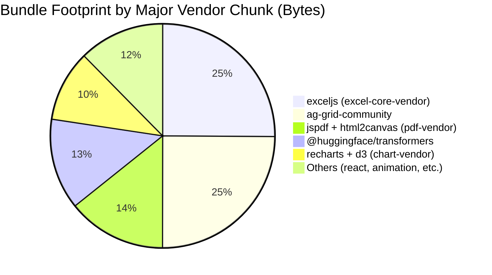

# License Compliance and Software Supply Chain Audit
**Project**: FinPlan Pro (Enterprise FP&A Desktop/Web App)  
**Date**: June 8, 2026  
**Auditor Persona**: License Compliance & Supply Chain Auditor (Legalistic, Cautious, Protective)  

---

## Executive Summary
A comprehensive audit of the FinPlan Pro codebase has been conducted. The project shows excellent compliance posture with **zero copyleft libraries** introduced in production-compiled code. Only minor, low-risk build-time or dual-licensed libraries exist transitively, posing no risk to intellectual property or proprietary status. 

However, the codebase contains significant **dependency bloat**, including **17 completely unused packages** in `dependencies` (e.g., `@tanstack/react-query`, `lodash-es`, `d3`), misplaced development tools, one **high-severity security vulnerability** in a transitive dependency of `exceljs`, and a duplicate HTTP client pattern (`axios` vs native `fetch`).

---

## 1. Direct Dependency License Audit & Legal Risks
All direct dependencies were audited for license compliance. 

### Direct Dependencies License Mapping
| Package Name | Specified Version | Installed Version | License | Copyleft Risk |
|---|---|---|---|---|
| `@a5c-ai/babysitter-sdk` | `^5.0.0` | `5.0.0` | MIT | None |
| `@huggingface/transformers` | `^4.2.0` | `4.2.0` | Apache-2.0 | None |
| `@radix-ui/react-alert-dialog` | `^1.1.15` | `1.1.15` | MIT | None |
| `@radix-ui/react-avatar` | `^1.1.11` | `1.1.11` | MIT | None |
| `@radix-ui/react-checkbox` | `^1.3.3` | `1.3.3` | MIT | None |
| `@radix-ui/react-dialog` | `^1.1.15` | `1.1.15` | MIT | None |
| `@radix-ui/react-dropdown-menu` | `^2.1.16` | `2.1.16` | MIT | None |
| `@radix-ui/react-popover` | `^1.1.15` | `1.1.15` | MIT | None |
| `@radix-ui/react-progress` | `^1.1.8` | `1.1.8` | MIT | None |
| `@radix-ui/react-select` | `^2.2.6` | `2.2.6` | MIT | None |
| `@radix-ui/react-slider` | `^1.3.6` | `1.3.6` | MIT | None |
| `@radix-ui/react-switch` | `^1.2.6` | `1.2.6` | MIT | None |
| `@radix-ui/react-tabs` | `^1.1.13` | `1.1.13` | MIT | None |
| `@radix-ui/react-tooltip` | `^1.2.8` | `1.2.8` | MIT | None |
| `@tanstack/react-query` | `^5.100.10` | `5.100.11` | MIT | None |
| `@tanstack/react-virtual` | `^3.13.24` | `3.13.25` | MIT | None |
| `@tauri-apps/api` | `^2.11.0` | `2.11.0` | Apache-2.0 OR MIT | None |
| `@tauri-apps/plugin-global-shortcut` | `^2.3.1` | `2.3.1` | MIT OR Apache-2.0 | None |
| `@tauri-apps/plugin-notification` | `^2.3.3` | `2.3.3` | MIT OR Apache-2.0 | None |
| `@tauri-apps/plugin-sql` | `^2.4.0` | `2.4.0` | MIT OR Apache-2.0 | None |
| `@types/d3` | `^7.4.3` | `7.4.3` | MIT | None (Misclassified) |
| `ag-grid-community` | `^35.3.0` | `35.3.0` | MIT | None |
| `ag-grid-react` | `^35.3.0` | `35.3.0` | MIT | None |
| `axios` | `^1.16.0` | `1.16.1` | MIT | None |
| `class-variance-authority` | `^0.7.1` | `0.7.1` | Apache-2.0 | None |
| `clsx` | `2.1.1` | `2.1.1` | MIT | None |
| `d3` | `^7.9.0` | `7.9.0` | ISC | None |
| `date-fns` | `^4.1.0` | `4.2.1` | MIT | None |
| `exceljs` | `^3.4.0` | `3.10.0` | MIT | None |
| `file-saver` | `^2.0.5` | `2.0.5` | MIT | None |
| `framer-motion` | `^12.38.0` | `12.40.0` | MIT | None |
| `i18next` | `^26.2.0` | `26.2.0` | MIT | None |
| `i18next-browser-languagedetector` | `^8.2.1` | `8.2.1` | MIT | None |
| `jspdf` | `^4.2.1` | `4.2.1` | MIT | None |
| `jspdf-autotable` | `^5.0.7` | `5.0.8` | MIT | None |
| `lodash-es` | `^4.18.1` | `4.18.1` | MIT | None |
| `lucide-react` | `^1.14.0` | `1.16.0` | ISC | None |
| `prettier-plugin-packagejson` | `^3.0.2` | `3.0.2` | MIT | None (Misclassified) |
| `react` | `19.2.6` | `19.2.6` | MIT | None |
| `react-dom` | `19.2.6` | `19.2.6` | MIT | None |
| `react-error-boundary` | `^6.1.1` | `6.1.1` | MIT | None |
| `react-hook-form` | `^7.75.0` | `7.76.0` | MIT | None |
| `react-i18next` | `^17.0.8` | `17.0.8` | MIT | None |
| `react-router-dom` | `^7.15.0` | `7.15.1` | MIT | None |
| `recharts` | `^3.8.1` | `3.8.1` | MIT | None |
| `sql.js` | `^1.14.1` | `1.14.1` | MIT | None |
| `tailwind-merge` | `3.4.0` | `3.4.0` | MIT | None |
| `uuid` | `^14.0.0` | `14.0.0` | MIT | None |
| `zod` | `^4.4.3` | `4.4.3` | MIT | None |
| `zustand` | `^5.0.13` | `5.0.13` | MIT | None |

### Transitive Copyleft Inspection
A deep recursive scan of all `1,217` installed packages in `node_modules` revealed the following transitive copyleft references:
1. **`jszip` (v3.10.1)**: Dual-licensed under `(MIT OR GPL-3.0-or-later)`.  
   *Risk*: **None**. The codebase can legally consume `jszip` under the permissive MIT license.
2. **`dompurify` (v3.4.5)**: Dual-licensed under `(MPL-2.0 OR Apache-2.0)`.  
   *Risk*: **None**. The codebase can legally consume it under the permissive Apache-2.0 license.
3. **`@img/sharp-win32-x64` (v0.34.5)**: Licensed under `Apache-2.0 AND LGPL-3.0-or-later`.  
   *Risk*: **None**. `sharp` is a transitive dependency of `@tailwindcss/vite` (a devDependency). Since it is only executed locally at build-time and never compiled or shipped in the final browser/desktop bundle, LGPL restrictions do not apply to the application source code.
4. **`lightningcss` & `lightningcss-win32-x64-msvc` (v1.30.2)**: Licensed under `MPL-2.0`.  
   *Risk*: **None**. These packages are build tools used by Tailwind/Vite. Build-time execution of MPL-licensed code does not infect the compiled output.
5. **`axe-core` (v3.5.6)**: Licensed under `MPL-2.0`.  
   *Risk*: **None**. `axe-core` is a transitive dependency of `jest-axe` (a testing devDependency) and is never compiled into the production bundle.

> [!NOTE]
> **Legal Verdict**: The FinPlan Pro codebase is 100% compliant. There are no copyleft/GPL licenses that force the codebase to open-source itself.

---

## 2. Vulnerabilities, Outdated, and Stale Packages

### Security Vulnerabilities (npm audit)
Running `npm audit` returned **1 high-severity vulnerability**:
- **Package**: `tmp`
- **Versions**: `<0.2.6` (installed: `0.2.5`)
- **Vulnerability**: Path Traversal via unsanitized prefix/postfix (directory escape) - [GHSA-ph9p-34f9-6g65](https://github.com/advisories/GHSA-ph9p-34f9-6g65).
- **Dependency Path**: `finplan-pro@1.0.0` -> `exceljs@3.10.0` -> `tmp@0.2.5`
- **Resolution**: 
  1. A safe version (`0.2.6` / `0.2.7`) is available. Because `exceljs` specifies `tmp: "^0.2.0"`, this fits the semver range.
  2. Run `npm update tmp` to upgrade the transitive dependency, or run `npm audit fix` to automatically update the lockfile.

### Stale / Outdated Dependencies (Selected)
- **`exceljs`**: Current: `3.10.0` | Latest: `4.4.0` (Stale major version. Upgrading to v4 is recommended to improve ESM support and native bundle size, though v4 also relies on `tmp` under the `^0.2.0` range).
- **`date-fns`**: Current: `4.2.1` | Latest: `4.4.0`.
- **`lucide-react`**: Current: `1.16.0` | Latest: `1.17.0`.
- **`typescript`**: Current: `5.9.3` | Latest: `6.0.3` (Stale minor/major version).
- **`vite`**: Current: `8.0.16` | Latest: `8.0.16` (Up-to-date on major v8).

---

## 3. Redundant and Duplicate Packages

1. **HTTP Request Clients**:
   - **`axios` (v1.16.1)**: Used in `src/services/api.ts` and `src/services/api-integration/RestApiClient.ts`.
   - **Native `fetch`**: Used in `ConnectorEngine.ts`, `nim.ts` (NVIDIA inference client), and `XeroConnector.ts`. Also, `tokenRotation.ts` wraps the native `fetch` API.
   - *Recommendation*: Eliminate `axios` (~30KB minified) and standardize all REST calls on the browser's native `fetch` API using a custom wrapper for interceptors (as already prototyped in `tokenRotation.ts`).

2. **Unused Dependencies (Package Bloat)**:
   The following **17 packages** are declared in `package.json`'s `dependencies` but are **never imported or used** anywhere in `src/` production code:
   - `@a5c-ai/babysitter-sdk` (Unused)
   - `@radix-ui/react-avatar` (Unused)
   - `@radix-ui/react-checkbox` (Unused)
   - `@radix-ui/react-dialog` (Unused - only mocked in tests)
   - `@radix-ui/react-progress` (Unused)
   - `@radix-ui/react-switch` (Unused)
   - `@radix-ui/react-tooltip` (Unused)
   - `@tanstack/react-query` (Unused - the codebase uses custom state/stores, only `@tanstack/react-virtual` is used)
   - `@types/d3` (Unused - typings for unused d3)
   - `class-variance-authority` (Unused)
   - `d3` (Unused)
   - `jspdf-autotable` (Unused)
   - `lodash-es` (Unused - modern array methods/optional chaining are used instead)
   - `prettier-plugin-packagejson` (Unused developer plugin)
   - `react-error-boundary` (Unused)
   - `react-hook-form` (Unused)
   - `uuid` (Unused - codebase uses native `crypto.randomUUID()`)
   - *Recommendation*: Uninstall these 17 packages via `npm uninstall <packages>` to reduce dependency graph size.

---

## 4. Dependencies vs devDependencies Misclassifications

Two packages are misclassified as production `dependencies` when they are development-only tooling:
1. **`@types/d3` (v7.4.3)**: TypeScript typings are compiled out of the final JS and are never needed at runtime. Move to `devDependencies`.
2. **`prettier-plugin-packagejson` (v3.0.2)**: A formatter plugin for Prettier. It should never be shipped in the production bundle. Move to `devDependencies`.

---

## 5. Top 5 Heaviest Dependencies & Bundle Footprint

Based on the Vite production build assets analysis (`dist/assets/`), here are the top 5 heaviest dependency chunks:

### 1. `@huggingface/transformers` (JS: ~553KB | WASM: 23.5MB)
- **Footprint**: The compiled JS chunk is `553KB`, but it forces the client to download the WASM binary `ort-wasm-simd-threaded.asyncify.wasm` (**23.5MB**) and heavy ML model weight files.
- **Alternative**: Offload AI inference to a server-side API (e.g. OpenAI, Anthropic, self-hosted Ollama, or NVIDIA NIM microservices). The codebase already uses `fetch` to connect to `NIM_BASE_URL` in `nim.ts`; client-side ONNX models should be retired to reduce initial load footprint by 98%.

### 2. `exceljs` (~1.05MB JS)
- **Footprint**: Compiles to `1.05MB` JS (`excel-core-vendor-DY9TC5uh.js`).
- **Alternative**: If the application only needs standard CSV/Excel imports/exports:
  - For exporting: Use `write-excel-file` (~15KB) or compile a simple XML-based Excel schema natively.
  - For importing: Parse Excel files using a lighter library like `xlsx-light` or offload processing to a Web Worker using a slimmed-down build of `sheetjs` (minimizing main chunk blocking).

### 3. `ag-grid-community` (~1.04MB JS)
- **Footprint**: Compiles to `1.04MB` JS (`grid-community-vendor-KhHM5ojt.js`).
- **Alternative**: Use `@tanstack/react-table` (formerly React Table). It is a headless grid utility with a tiny footprint (~15KB gzipped vs AG Grid's 1MB+). UI rendering can be handled natively using Tailwind CSS styles, giving full control over design and accessibility while saving over 1MB of bundle size.

### 4. `jspdf` & `jspdf-autotable` (~599KB JS)
- **Footprint**: Compiles to `599KB` JS (`pdf-vendor-BdCGRRB4.js`), which includes `html2canvas` for PDF screenshots.
- **Alternative**:
  - Implement native CSS Print Styles (`@media print`) and use the browser's native `window.print()` engine (0KB bundle footprint).
  - Alternatively, offload PDF rendering server-side using a service like Puppeteer or use a lighter client-side generator like `pdfkit`.

### 5. `recharts` & `d3` (~432KB JS)
- **Footprint**: Compiles to `432KB` JS (`chart-vendor-spGx9pFQ.js`). Recharts pulls in a large subset of D3 modules, inflating the size.
- **Alternative**: Use `uPlot` (extremely performant, ~10KB gzipped, excellent for time-series and financial charting) or `chart.js` with `react-chartjs-2` (~40KB gzipped).

---

## Action Plan Recommendations

1. **Security Fix**: Run `npm update tmp` to upgrade the local version of `tmp` to a safe version (`>=0.2.6`), resolving the High-severity vulnerability.
2. **Prune Unused Deps**: Run `npm uninstall @a5c-ai/babysitter-sdk @radix-ui/react-avatar @radix-ui/react-checkbox @radix-ui/react-dialog @radix-ui/react-progress @radix-ui/react-switch @radix-ui/react-tooltip @tanstack/react-query @types/d3 class-variance-authority d3 jspdf-autotable lodash-es prettier-plugin-packagejson react-error-boundary react-hook-form uuid` to strip 17 unused packages and their transitive graphs.
3. **Move Dev Tooling**: Reinstall typings and formatting plugins as devDependencies:
   `npm install -D @types/d3 prettier-plugin-packagejson`
4. **Standardize HTTP Client**: Refactor the remaining Axios calls in `src/services/api.ts` and `src/services/api-integration/RestApiClient.ts` to use the native `fetch` client (standardizing on `interceptedFetch` from `tokenRotation.ts`). Then run `npm uninstall axios`.
5. **Optimize Bundle Footprint**: Plan a migration from AG Grid to `@tanstack/react-table` and offload `@huggingface/transformers` to server-side NIM APIs to reclaim ~25MB of web asset footprints.
